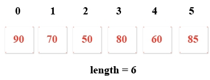

# 1.线性表定义

## 线性表：

元素序列是一维数组。

**1. 定义一组学生分数的一维数组**



**TestOneArray.go**

```go
package main
import "fmt"
func main() {
    var scores = []int {90 , 70 , 50 , 80 , 60 , 85 }
    var length = len (scores)
    for i := 0 ; i < length; i++ {
   		fmt.Printf("%d," , scores[i])
    }
}
```

**结果：**

```
90,70,50,80,60,85,
```

