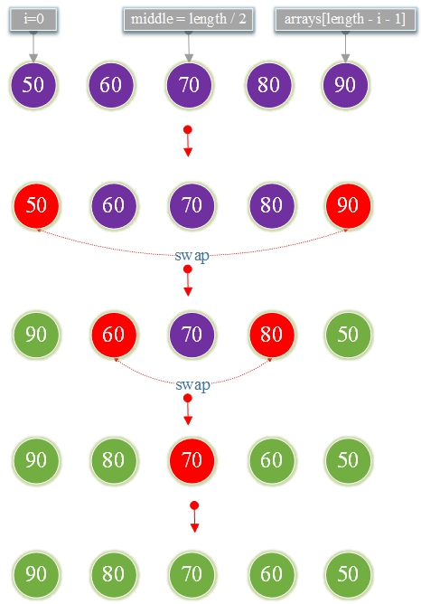

# 10.反向数组

**有序序列反转：**


**1.算法思想**

初始<font color="red">i = 0 </font>，然后将第一个元素<font color="red">arrays[i] </font>与最后一个元素<font color="red">arrays[length-i-1]</font>交换

重复直到中间索引<font color="red">i == length / 2 </font>。



**TestReverse.go**

```go
package main

import "fmt"

func reverse(arrays []int, length int)  {
	var middle=length/2
	for i := 0; i < middle; i++ {
		var temp=arrays[i]
		arrays[i]=arrays[length-i-1]
		arrays[length-i-1]=temp
	}
}

func main() {
	var scores = []int {50 , 60 , 70 , 80 , 90 }
	var length = len (scores)
	reverse(scores,length)
	for i := 0; i < length; i++ {
		fmt.Printf("%d,",scores[i])
	}
}
```

**结果:**

```
90,80,70,60,50,
```

