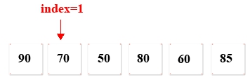

# 11.线性表搜索

**1.请输入您想要搜索的值，如:<font color="red">70</font>返回索引。**



**分析：**

遍历数组分数中的值，如果有一个值等于给定值（如<font color="red">70</font>） ，则打印出当前索引

**TestOneArraySearch.go**

```go
package main

import "fmt"

func main() {
	var scores = []int {90 , 70 , 50 , 80 , 60 , 85 }
	fmt.Printf("请输入您想要搜索的值:\n")
	var value int
	fmt.Scan(&value)

	var isSeach=false
	var length=len(scores)
	for i := 0; i < length; i++ {
		if scores[i]==value{
			isSeach=true
			fmt.Printf("找到值:%d 索引为:%d",value,i)
			break
		}
	}
	if !isSeach {
		fmt.Printf("未找到该值：%d",value)
	}
}
```

结果：

```
请输入您想要搜索的值:
70
找到值:70 索引为:1
```

