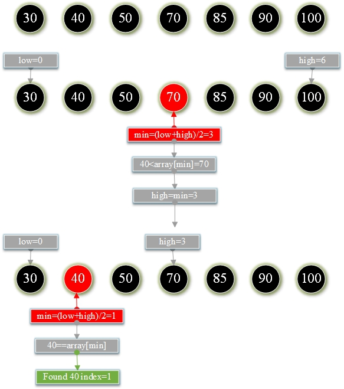
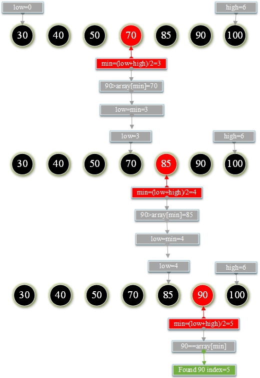

# 12.二分法二分搜索

**二分法二分查找：**

从已经排序的数组中找到给定值的索引位置。


1. 初始化最低索引<font color="red">low = 0 </font>，最高索引<font color="red">high = scores.length-1</font>

2. 找到中间索引<font color="red">mid=(low+high)/2</font>  <font color="green">scores[mid]</font> 的<font color="green">searchValue</font> 

3. 将<font color="green">scores[mid] </font>与<font color="green">searchValue</font>进行比较

   如果<font color="green">scores [mid] == searchValue</font>打印当前mid索引，

   如果<font color="green">scores [mid]> searchValue </font>， 则<font color="green">searchValue</font>在<font color="red">low </font>和 <font color="red">mid-1</font>之间

4. 依此类推。重复步骤3，直到找到<font color="green">searchValue</font>或<font color="red">low> = high</font> 终止循环。

**示例1：在下面已排序的数组中找到<font color="green">searchValue = 40</font>的索引。**



**示例2：在下面已排序的数组中找到<font color="green">searchValue = 90</font>的索引。**



**TestBinarySearch.go**

```go
package main

import "fmt"

func main() {
	var scores = []int {30 , 40 , 50 , 70 , 85 , 90 , 100 }
	var length = len (scores)
	var searchValue = 40
	var position = binarySearch(scores, length, searchValue)
	fmt.Printf("%d 位置 : %d" , searchValue, position)
	fmt.Printf("\n-----------------------------\n" )
	searchValue = 90
	position = binarySearch(scores, length, searchValue)
	fmt.Printf("%d 位置 : %d" , searchValue, position)
}

func binarySearch(arrays []int, length int, searchValue int) int {
	var low=0
	var high=length
	var mid=0
	for {
		if low >= high {
			break
		}
		mid=(low+high)/2
		if arrays[mid]==searchValue{
			return mid
		}else if arrays[mid]<searchValue{
			low=mid+1
		}else if arrays[mid]>searchValue{
			high=mid-1
		}
	}
	return -1
}
```

**结果：**

```
40 位置 : 1
-----------------------------
90 位置 : 5
```

