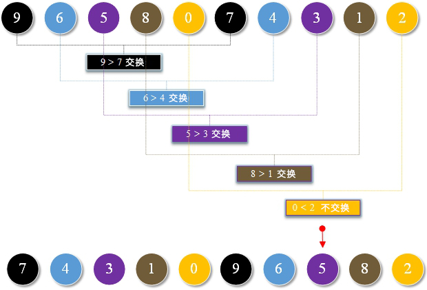
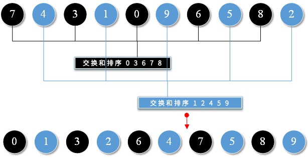
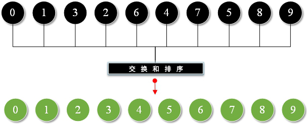

# 13.希尔排序

**希尔排序:**

希尔排序是一种高效的排序算法，它基于插入排序算法。如果较小的值在最右端并且必须移到最左端，则该算法避免了在插入排序的情况下发生大的移位。

**通过希尔排序将以下数字从小到大排序**


**算法的结果:**

数组按照一定的下标增量分组，并对每一组的插入进行排序。随着增量的逐渐减小，直到增量为1，对整个数据进行分组和排序。

**1.第一次排序：**

**<font color="red">gap = array.length / 2 = 5</font>**



**2.第二次排序：**

**<font color="red">gap = 5 / 2 = 2</font>**



**3.第三次排序：**

**<font color="red">gap = 2 / 2 = 1</font>**



**TestShellSort.go**

```go
package main

import "fmt"

func swap(arrays []int,a int,b int)  {
	arrays[a]=arrays[a]+arrays[b]
	arrays[b]=arrays[a]-arrays[b]
	arrays[a]=arrays[a]-arrays[b]
}

func shellSort(array []int,length int)  {
	for gap := length/2; gap >0 ; gap=gap/2 {
		for i := gap; i < length; i++ {
			var j=i
			for{
				if j-gap<0 || array[j]>=array[j-gap]{
					break
				}
				swap(array,j,j-gap)
				j=j-gap
			}
		}
	}
}

func main() {
	var scores = []int {9 , 6 , 5 , 8 , 0 , 7 , 4 , 3 , 1 , 2 }
	var length = len (scores)
	shellSort(scores,length)
	for i := 0; i < length; i++ {
		fmt.Printf("%d,",scores[i])
	}
}
```

**结果:**

```
0,1,2,3,4,5,6,7,8,9,
```

