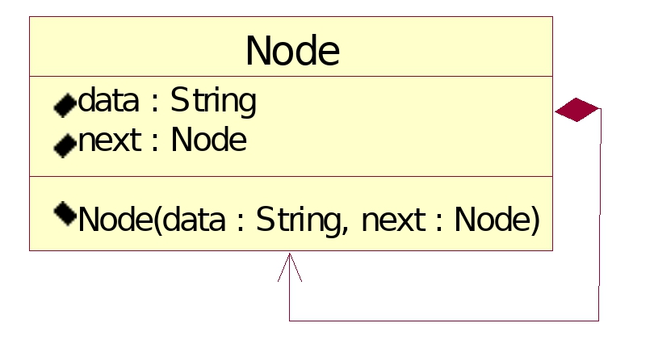

# 14.单向链表

**单向链表单链接:**

是一种链式存储结构的线性表，由一个节点连接。每个节点由数据和指向下一个节点的下一个指针组成。


**UML图:**



```go
type Node struct {
data string
next *Node
}
```

### 1.单向链表<font color="red">初始化</font>

示例:构建一个旧金山地铁单向链表


### 2.遍历输出


**TestUnidirectionalLinkedList.go**

```go
package main

import "fmt"

type Node struct {
	data string
	next *Node
}

var head *Node=new(Node)//第一个节点叫做头节点

func initial()  {
	head.data="San Francisco"
	head.next=nil

	var nodeOakland *Node = &Node{data:"Oakland",next: nil}
	head.next=nodeOakland

	var nodeBerkeley *Node = &Node{data: "Berkeley" , next: nil }
	nodeOakland.next = nodeBerkeley

	var tail *Node = &Node{data: "Fremont" , next: nil }
	nodeBerkeley.next = tail
}

func output(node *Node)  {
	var p=node
	for{
		if p == nil {
			break
		}
		fmt.Printf("%s->",p.data)
		p=p.next
	}
	fmt.Printf("End\n\n")
}

func main() {
	initial()
	output(head)
}
```

**结果：**

```
San Francisco -> Oakland -> Berkeley -> Fremont -> End
```


### 3.在末尾添加一个新节点名称:<font color="red">Walnut</font>


**TestUnidirectionalLinkedList2.go**

```go
package main

import "fmt"

type Node struct {
	data string
	next *Node
}

var head *Node=new(Node)
var tail *Node=new(Node)

func initial()  {
	head.data="San Francisco"
	head.next=nil

	var nodeOakland *Node = &Node{data:"Oakland",next: nil}
	head.next=nodeOakland

	var nodeBerkeley *Node = &Node{data: "Berkeley" , next: nil }
	nodeOakland.next = nodeBerkeley

	tail.data="Fremont"
	tail.next=nil
	nodeBerkeley.next = tail
}

func add(data string)  {
	var newNode *Node=&Node{data:data,next: nil}
	tail.next=newNode
	tail=newNode
}

func output(node *Node)  {
	var p=node
	for{
		if p == nil {
			break
		}
		fmt.Printf("%s->",p.data)
		p=p.next
	}
	fmt.Printf("End\n\n")
}


func main() {
	initial()
	fmt.Printf("在末尾添加一个新节点名称:Walnut \n")
	add("Walnut")
	output(head)
}
```

**结果：**

```
在末尾添加一个新节点名称:Walnut
San Francisco->Oakland->Berkeley->Fremont->Walnut->End
```


### 4.在2号位置插入一个节点<font color="red">Walnut</font>:


**TestUnidirectionalLinkedList3.go**

```go
package main

import "fmt"

type Node struct {
	data string
	next *Node
}

var head *Node=new(Node)
var tail *Node=new(Node)

func initial()  {
	head.data="San Francisco"
	head.next=nil

	var nodeOakland *Node = &Node{data:"Oakland",next: nil}
	head.next=nodeOakland

	var nodeBerkeley *Node = &Node{data: "Berkeley" , next: nil }
	nodeOakland.next = nodeBerkeley

	tail.data="Fremont"
	tail.next=nil
	nodeBerkeley.next = tail
}

func insert(insertPosition int,data string)  {
	var p=head
	var i=0
	//将节点移动到插入位置
	for{
		if p.next==nil || i>=insertPosition-1{
			break
		}
		p=p.next
		i++
	}
	var newNode *Node=new(Node)
	newNode.data=data
	newNode.next=p.next//newNode.next指向下一个点
	p.next=newNode//当前的下一点是newNode
}
func output(node *Node)  {
	var p=node
	for{
		if p == nil {
			break
		}
		fmt.Printf("%s->",p.data)
		p=p.next
	}
	fmt.Printf("End\n\n")
}


func main() {
	initial()
	fmt.Printf("在index = 2处插入一个新节点Walnut \n")
	insert(2,"Walnut")
	output(head)
}
```

**结果：**

```
在index = 2处插入一个新节点Walnut
San Francisco->Oakland->Walnut->Berkeley->Fremont->End
```


### 5.删除<font color="red">index = 2</font>节点


**TestUnidirectionalLinkedList4.go**

```go
package main

import "fmt"

type Node struct {
	data string
	next *Node
}

var head *Node=new(Node)
var tail *Node=new(Node)

func initial()  {
	head.data="San Francisco"
	head.next=nil

	var nodeOakland *Node = &Node{data:"Oakland",next: nil}
	head.next=nodeOakland

	var nodeBerkeley *Node = &Node{data: "Berkeley" , next: nil }
	nodeOakland.next = nodeBerkeley

	tail.data="Fremont"
	tail.next=nil
	nodeBerkeley.next = tail
}

func removeNode(removePosition int){
	var p=head
	var i=0
	//将节点移动到要删除节点的前一位置
	for{
		if p.next==nil || i>=removePosition-1{
			break
		}
		p=p.next
		i++
	}
	var temp=p.next//保存要删除的节点
	p.next=p.next.next//上个节点的next指向要删除节点的下一个节点
	temp.next=nil
}

func output(node *Node)  {
	var p=node
	for{
		if p == nil {
			break
		}
		fmt.Printf("%s->",p.data)
		p=p.next
	}
	fmt.Printf("End\n\n")
}


func main() {
	initial()
	fmt.Printf("删除index=2处的新节点Berkeley \n")
	removeNode(2)
	output(head)
}
```

**结果:**

```
删除index=2处的新节点Berkeley
San Francisco->Oakland->Fremont->End
```

