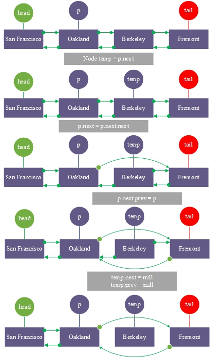

# 15.双向链表

**双链表：**

它是线性表的链接存储结构。它通过两个方向上的节点连接。每个节点由数据组成，指向前一个节点并指向下一个节点。


**UML图**


```go
type Node struct {
data string
prev *Node
next *Node
}
```

### 1.双链表<font color="red">初始化</font>

示例:构建一个旧金山地铁双链接列表


### 2.<font color="red">遍历输出</font>.TestDoubleLink.go

```go
package main

import (
	"fmt"
)

type Node struct {
	data string
	prev *Node
	next *Node
}

var head *Node=new(Node)
var tail *Node=new(Node)

func initial()  {
	head.data = "San Francisco"
	head.prev = nil
	head.next = nil

	var nodeOakland *Node = &Node{data: "Oakland" , prev: head, next: nil }
	head.next = nodeOakland

	var nodeBerkeley *Node = &Node{data: "Berkeley" , prev: nodeOakland, next: nil }
	nodeOakland.next = nodeBerkeley

	tail.data = "Fremont"
	tail.prev = nodeBerkeley
	tail.next = nil
	nodeBerkeley.next = tail
}

func output(node *Node){
	var p=node
	var end *Node=nil
	for{
		if p == nil{
			break
		}
		fmt.Printf("%s->",p.data)
		end=p
		p=p.next
	}
	fmt.Printf("End\n")
	p=end
	for{
		if p == nil {
			break
		}
		fmt.Printf("%s->",p.data)
		p=p.prev
	}
	fmt.Printf("Start\n\n")
}

func main() {
	initial()
	output(head)
}
```

**结果:**

```
San Francisco->Oakland->Berkeley->Fremont->End
Fremont->Berkeley->Oakland->San Francisco->Start
```

### 3.在Fremont的尽头添加一个<font color="red">Walnut</font>节点。


**TestDoubleLink2.go**

```go
package main

import (
	"fmt"
)

type Node struct {
	data string
	prev *Node
	next *Node
}

var head *Node=new(Node)
var tail *Node=new(Node)

func initial()  {
	head.data = "San Francisco"
	head.prev = nil
	head.next = nil

	var nodeOakland *Node = &Node{data: "Oakland" , prev: head, next: nil }
	head.next = nodeOakland

	var nodeBerkeley *Node = &Node{data: "Berkeley" , prev: nodeOakland, next: nil }
	nodeOakland.next = nodeBerkeley

	tail.data = "Fremont"
	tail.prev = nodeBerkeley
	tail.next = nil
	nodeBerkeley.next = tail
}

func add(data string) {
	var newNode *Node=new(Node)
	newNode.data=data
	newNode.next=nil
	tail.next=newNode
	newNode.prev=tail
	tail=newNode
}

func output(node *Node){
	var p=node
	var end *Node=nil
	for{
		if p == nil{
			break
		}
		fmt.Printf("%s->",p.data)
		end=p
		p=p.next
	}
	fmt.Printf("End\n")
	p=end
	for{
		if p == nil {
			break
		}
		fmt.Printf("%s->",p.data)
		p=p.prev
	}
	fmt.Printf("Start\n\n")
}

func main() {
	initial()

	fmt.Printf("添加一个新节点 Walnut : \n" )
	add("Walnut" )

	output(head)
}
```

**结果:**

```
添加一个新节点 Walnut :
San Francisco->Oakland->Berkeley->Fremont->Walnut->End
Walnut->Fremont->Berkeley->Oakland->San Francisco->Start
```

### 4.在2号位置插入一个节点<font color="red">Walnut</font>


**TestDoubleLink3.go**

```go
package main

import (
	"fmt"
)

type Node struct {
	data string
	prev *Node
	next *Node
}

var head *Node=new(Node)
var tail *Node=new(Node)

func initial()  {
	head.data = "San Francisco"
	head.prev = nil
	head.next = nil

	var nodeOakland *Node = &Node{data: "Oakland" , prev: head, next: nil }
	head.next = nodeOakland

	var nodeBerkeley *Node = &Node{data: "Berkeley" , prev: nodeOakland, next: nil }
	nodeOakland.next = nodeBerkeley

	tail.data = "Fremont"
	tail.prev = nodeBerkeley
	tail.next = nil
	nodeBerkeley.next = tail
}

func insert(insertPostion int, data string) {
	var p =head
	var i=0
	for{
		if p.next==nil || i>=insertPostion-1{
			break
		}
		p=p.next
		i++
	}
	var newNode *Node=new(Node)
	newNode.data=data
	newNode.next=p.next//newNode下一节点是p的下一节点
	p.next=newNode//当前节点的下一节点指向newNode
	newNode.prev=p
	newNode.next.prev=newNode
}

func output(node *Node){
	var p=node
	var end *Node=nil
	for{
		if p == nil{
			break
		}
		fmt.Printf("%s->",p.data)
		end=p
		p=p.next
	}
	fmt.Printf("End\n")
	p=end
	for{
		if p == nil {
			break
		}
		fmt.Printf("%s->",p.data)
		p=p.prev
	}
	fmt.Printf("Start\n\n")
}

func main() {
	initial()

	fmt.Printf("在索引2处插入一个新节点 Walnut : \n" )
	insert(2,"Walnut")

	output(head)
}
```

结果:

```
在索引2处插入一个新节点 Walnut :
San Francisco->Oakland->Walnut->Berkeley->Fremont->End
Fremont->Berkeley->Walnut->Oakland->San Francisco->Start
```

### 5.删除<font color="red">index=2</font>的节点



**TestDoubleLink4.go**

```go
package main

import (
	"fmt"
)

type Node struct {
	data string
	prev *Node
	next *Node
}

var head *Node=new(Node)
var tail *Node=new(Node)

func initial()  {
	head.data = "San Francisco"
	head.prev = nil
	head.next = nil

	var nodeOakland *Node = &Node{data: "Oakland" , prev: head, next: nil }
	head.next = nodeOakland

	var nodeBerkeley *Node = &Node{data: "Berkeley" , prev: nodeOakland, next: nil }
	nodeOakland.next = nodeBerkeley

	tail.data = "Fremont"
	tail.prev = nodeBerkeley
	tail.next = nil
	nodeBerkeley.next = tail
}

func removeNode(removePostion int) {
	var p =head
	var i=0
	//将节点移动到要删除的节点的前一节点位置
	for{
		if p.next==nil || i>=removePostion-1{
			break
		}
		p=p.next
		i++
	}
	var temp=p.next//保存要删除的节点
	p.next=p.next.next//p.next指向要删除节点的下一节点
	p.next.prev=p
	temp.next=nil
	temp.prev=nil
}

func output(node *Node){
	var p=node
	var end *Node=nil
	for{
		if p == nil{
			break
		}
		fmt.Printf("%s->",p.data)
		end=p
		p=p.next
	}
	fmt.Printf("End\n")
	p=end
	for{
		if p == nil {
			break
		}
		fmt.Printf("%s->",p.data)
		p=p.prev
	}
	fmt.Printf("Start\n\n")
}

func main() {
	initial()

	fmt.Printf("删除index=2的节点 : \n" )
	removeNode(2 )

	output(head)
}
```

**结果:**

```
删除index=2的节点 :
San Francisco->Oakland->Fremont->End
Fremont->Oakland->San Francisco->Start
```