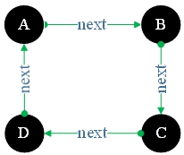
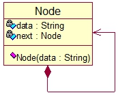
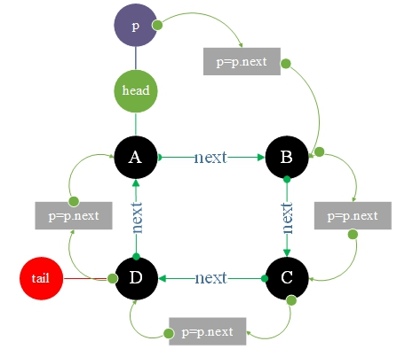
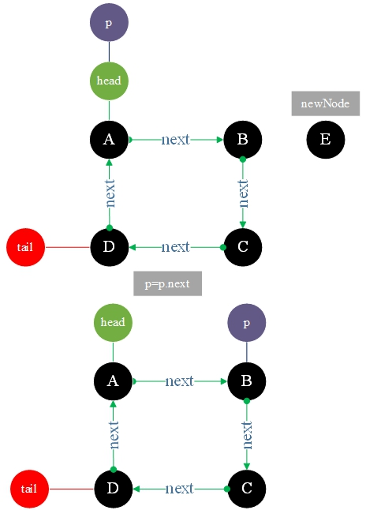
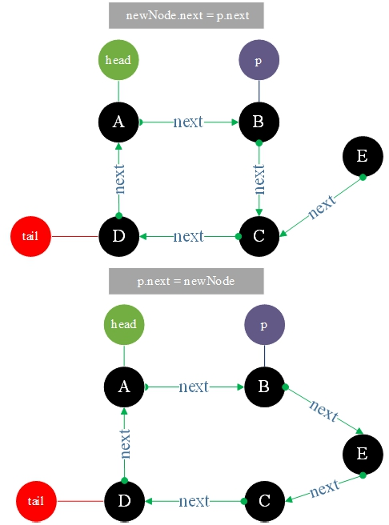
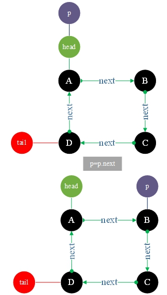
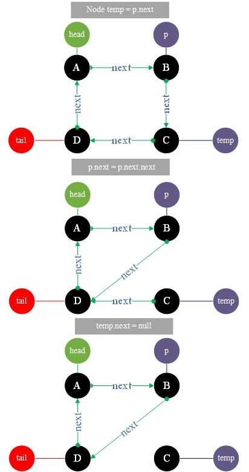

# 16.单向循环链表

**单向循环列表:**

它是线性表的链存储结构，表之间连接成一个环，每个节点由数据和一个指向next的指针组成。



**UML图**



```go
type Node struct {
data string
next *Node
}
```

### 1.单向循环链表<font color="red">初始化和遍历输出</font>



**TestSingleCircleLink.go**

```go
package main
import "fmt"

type Node struct {
	data string
	next *Node
}

var head *Node = new (Node)
var tail *Node = new (Node)

func initial() {
	head.data = "A"
	head.next = nil

	var nodeB *Node = &Node{data: "B" , next: nil }
	head.next = nodeB

	var nodeC *Node = &Node{data: "C" , next: nil }
	nodeB.next = nodeC

	tail.data = "D"
	tail.next = head
	nodeC.next = tail
}

func output(node *Node) {
	var p = node
	for {
		fmt.Printf("%s -> " , p.data)
		p = p.next
		if p == head {
			break
		}
	}
	fmt.Printf("%s \n\n" , p.data)
}

func main() {
	initial()
	output(head)
}
```

**结果:**

```
A -> B -> C -> D -> A
```

### 2.在位置2插入<font color="red">E</font>节点





**TestSingleCircleLink2.go**

```go
package main
import "fmt"

type Node struct {
	data string
	next *Node
}

var head *Node = new (Node)
var tail *Node = new (Node)

func initial() {
	head.data = "A"
	head.next = nil

	var nodeB *Node = &Node{data: "B" , next: nil }
	head.next = nodeB

	var nodeC *Node = &Node{data: "C" , next: nil }
	nodeB.next = nodeC

	tail.data = "D"
	tail.next = head
	nodeC.next = tail
}

func insert(insertPosition int,data string){
	var p=head
	var i=0
	//将节点移动到插入位置
	for{
		if p.next == nil || i >= insertPosition-1 {
			break
		}
		p = p.next
		i++
	}
	var newNode *Node=new(Node)
	newNode.data=data
	newNode.next=p.next//newNode的下一节点指向p的下一节点
	p.next=newNode//p的下一节点指向newNode
}

func output(node *Node) {
	var p = node
	for {
		fmt.Printf("%s -> " , p.data)
		p = p.next
		if p == head {
			break
		}
	}
	fmt.Printf("%s \n\n" , p.data)
}

func main() {
	initial()
	fmt.Printf("在index = 2的位置插入新节点E : \n" )
	insert(2 , "E" )
	output(head)
}
```

**结果:**

```
在index = 2的位置插入新节点E :
A -> B -> E -> C -> D -> A
```


### 3.删除index=2的节点





**TestSingleCircleLink3.go**

```go
package main
import "fmt"

type Node struct {
	data string
	next *Node
}

var head *Node = new (Node)
var tail *Node = new (Node)

func initial() {
	head.data = "A"
	head.next = nil

	var nodeB *Node = &Node{data: "B" , next: nil }
	head.next = nodeB

	var nodeC *Node = &Node{data: "C" , next: nil }
	nodeB.next = nodeC

	tail.data = "D"
	tail.next = head
	nodeC.next = tail
}

func insert(insertPosition int,data string){
	var p=head
	var i=0
	//将节点移动到插入位置
	for{
		if p.next == nil || i >= insertPosition-1 {
			break
		}
		p = p.next
		i++
	}
	var newNode *Node=new(Node)
	newNode.data=data
	newNode.next=p.next//newNode的下一节点指向p的下一节点
	p.next=newNode//p的下一节点指向newNode
}

func removeNode(removePosition int) {
	var p=head
	var i=0
	//将节点移动到要删除的节点前一位置
	for{
		if p.next == nil || i >= removePosition-1 {
		break
	}
		p = p.next
		i++
	}

	var temp=p.next//保存要删除的节点
	p.next=p.next.next//当前节点指向要删除节点的下一节点
	temp.next=nil
}

func output(node *Node) {
	var p = node
	for {
		fmt.Printf("%s -> " , p.data)
		p = p.next
		if p == head {
			break
		}
	}
	fmt.Printf("%s \n\n" , p.data)
}

func main() {
	initial()
	fmt.Printf("删除index = 2的节点 : \n" )
	removeNode(2)
	output(head)
}
```

**结果：**

```
删除index = 2的节点 :
A -> B -> D -> A
```

