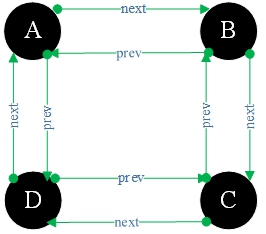
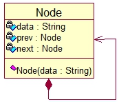
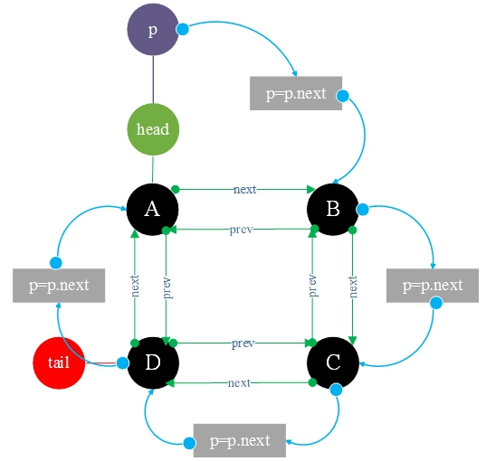
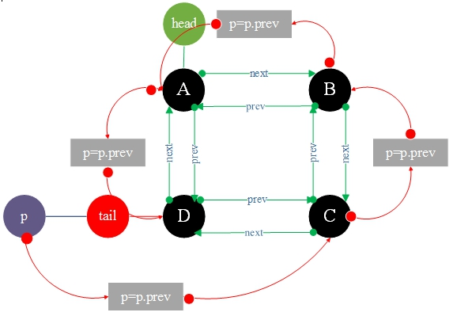
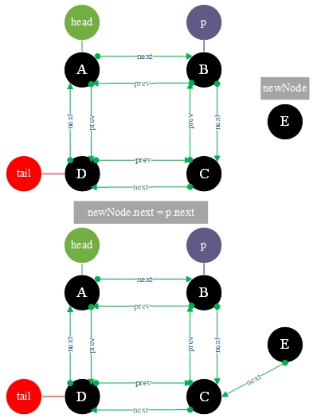
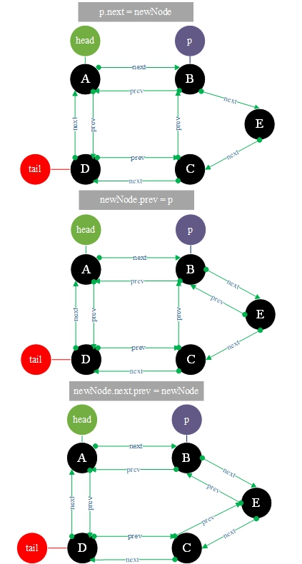
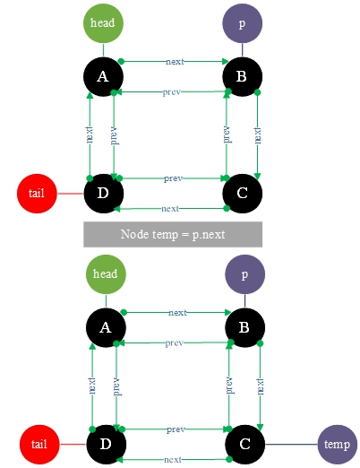
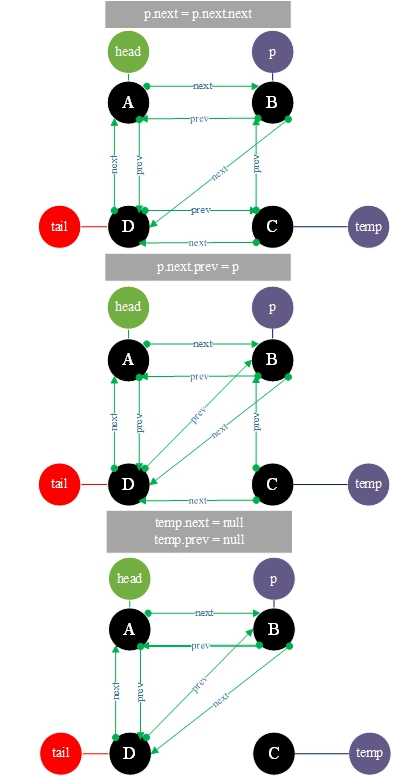

# 17.双向循环链表

**双向循环列表：**

它是一个线性表的链存储结构。节点由两个方向串联，并连接成一个环。每个节点都由数据组成，指向前一个节点<font color="red">prev</font>，指向下一个节点<font color="red">next</font>。



**UML图**



```go
type Node struct {
	data string
	prev *Node
	next *Node
}
```

### 1.双向循环链表初始化和遍历输出。





**TestDoubleCircleLink.go**

```go
package main

import "fmt"

type Node struct {
	data string
	prev *Node
	next *Node
}
var head *Node = new (Node)
var tail *Node = new (Node)


func initial(){
	head.data = "A"
	head.prev = nil
	head.next = nil

	var nodeB *Node = &Node{data: "B" , prev: head, next: nil }
	head.next = nodeB

	var nodeC *Node = &Node{data: "C" , prev: nodeB, next: nil }
	nodeB.next = nodeC

	tail.data = "D"
	tail.prev = nodeC
	tail.next = head
	nodeC.next = tail
	head.prev = tail
}

func output() {
	var p = head
	for {
		fmt.Printf("%s -> " , p.data)
		p = p.next
		if p == head {
			break
		}
	}
	fmt.Printf("%s " , p.data)
	fmt.Printf("End\n" )
	p = tail
	for {
		fmt.Printf("%s -> " , p.data)
		p = p.prev
		if p == tail {
			break
		}
	}
	fmt.Printf("%s " , p.data)
	fmt.Printf("Start\n\n" )
}
func main() {
	initial()
	output()
}
```

**结果:**

```
A -> B -> C -> D -> A End
D -> C -> B -> A -> D Start
```


### 2.在位置2插入节点<font color="red">E</font>





**TestDoubleCircleLink2.go**

```go
package main

import "fmt"

type Node struct {
	data string
	prev *Node
	next *Node
}
var head *Node = new (Node)
var tail *Node = new (Node)


func initial(){
	head.data = "A"
	head.prev = nil
	head.next = nil

	var nodeB *Node = &Node{data: "B" , prev: head, next: nil }
	head.next = nodeB

	var nodeC *Node = &Node{data: "C" , prev: nodeB, next: nil }
	nodeB.next = nodeC

	tail.data = "D"
	tail.prev = nodeC
	tail.next = head
	nodeC.next = tail
	head.prev = tail
}

func insert(insertPosition int, data string) {
	var p=head
	var i=0
	for{
		if p.next == nil || i >= insertPosition-1 {
			break
		}
		p = p.next
		i++
	}

	var newNode *Node=new(Node)
	newNode.data=data
	newNode.next=p.next
	p.next=newNode
	newNode.prev=p
	newNode.next.prev=newNode
}

func output() {
	var p = head
	for {
		fmt.Printf("%s -> " , p.data)
		p = p.next
		if p == head {
			break
		}
	}
	fmt.Printf("%s " , p.data)
	fmt.Printf("End\n" )
	p = tail
	for {
		fmt.Printf("%s -> " , p.data)
		p = p.prev
		if p == tail {
			break
		}
	}
	fmt.Printf("%s " , p.data)
	fmt.Printf("Start\n\n" )
}
func main() {
	initial()
	fmt.Printf("在索引2处插入一个新节点E : \n" )
	insert(2 , "E" )
	output()
}
```

**结果：**

```
在索引2处插入一个新节点E :
A -> B -> E -> C -> D -> A End
D -> C -> E -> B -> A -> D Start
```


### 3.删除<font color="red">index=2</font>的节点





**TestDoubleCircleLink3.go**

```go
package main

import "fmt"

type Node struct {
	data string
	prev *Node
	next *Node
}
var head *Node = new (Node)
var tail *Node = new (Node)


func initial(){
	head.data = "A"
	head.prev = nil
	head.next = nil

	var nodeB *Node = &Node{data: "B" , prev: head, next: nil }
	head.next = nodeB

	var nodeC *Node = &Node{data: "C" , prev: nodeB, next: nil }
	nodeB.next = nodeC

	tail.data = "D"
	tail.prev = nodeC
	tail.next = head
	nodeC.next = tail
	head.prev = tail
}

func removeNode(removePosition int ) {
	var p = head
	var i = 0
	for {
		if p.next == nil || i >= removePosition-1 {
			break
		}
		p = p.next
		i++
	}
	var temp = p.next     // 保存想要删除的节点
	p.next = p.next.next // p.next指向要删除节点的下一节点
	p.next.prev = p
	temp.next = nil // 设置要删除节点.next为null
	temp.prev = nil // 设置要删除节点.prev为null
}

func output() {
	var p = head
	for {
		fmt.Printf("%s -> " , p.data)
		p = p.next
		if p == head {
			break
		}
	}
	fmt.Printf("%s " , p.data)
	fmt.Printf("End\n" )
	p = tail
	for {
		fmt.Printf("%s -> " , p.data)
		p = p.prev
		if p == tail {
			break
		}
	}
	fmt.Printf("%s " , p.data)
	fmt.Printf("Start\n\n" )
}
func main() {
	initial()
	fmt.Printf("删除 index = 2 的节点: \n" )
	removeNode(2)
	output()
}
```

**结果:**

```
A -> B -> D -> A End
D -> B -> A -> D Start
```

