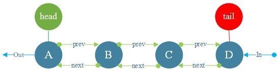
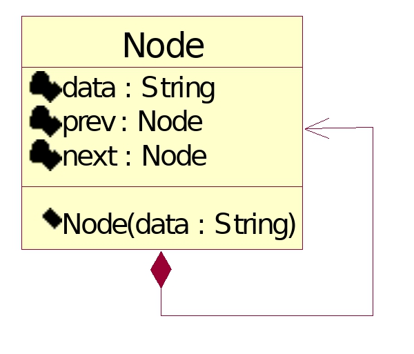
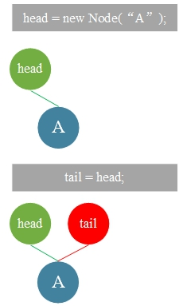
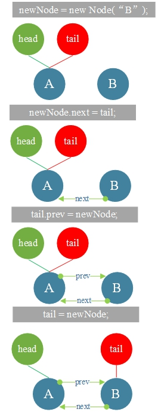
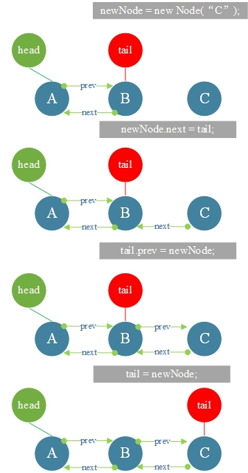
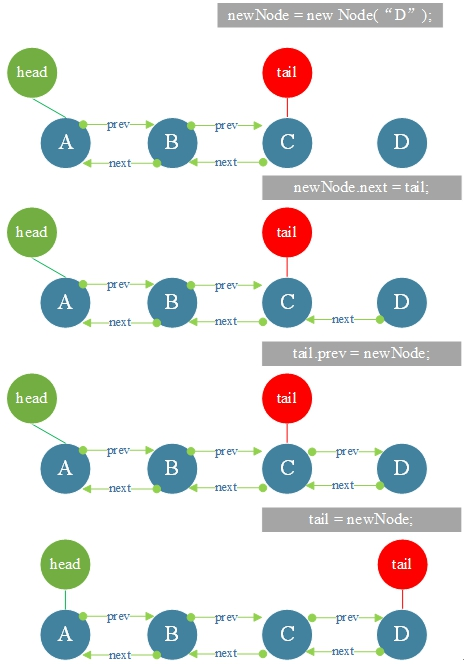

# 18.对列

**队列：**

FIFO（先进先出）序列。



**UML图**



```go
type Node struct {
	data string
	prev *Node
	next *Node
}
```

**1.队列<font color="red">初始化和遍历输出。</font>**

**初始化插入<font color="red">A</font>**



**初始化插入<font color="red">B</font>**



**初始化插入<font color="red">C</font>**



**初始化插入<font color="red">D</font>**



**Queue.go**

```go
package main

import "fmt"

type Node struct {
	data string
	prev *Node
	next *Node
}

var head *Node = nil
var tail *Node = new (Node)
var size int

func offer(element string){
	if head == nil {
		head=new(Node)
		head.data=element
		tail=head
	}else{
		var newNode *Node=new(Node)
		newNode.data=element
		newNode.next=tail
		tail.prev=newNode
		tail=newNode
	}
	size++
}

func poll()*Node {
	var p=head
	if p == nil {
		return nil
	}
	head=head.prev
	p.next=nil
	p.prev=nil
	size--
	return p
}

func output() {
	fmt.Printf("Head")
	var node *Node=nil
	for{
		node=poll()
		if node==nil{
			break
		}
		fmt.Printf("%s<-",node.data)
	}
	fmt.Printf("Tail\n")
}
func main() {
	offer("A" )
	offer("B" )
	offer("C" )
	offer("D" )
	output()
}
```

**结果：**

```
HeadA<-B<-C<-D<-Tail
```

