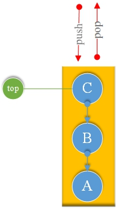
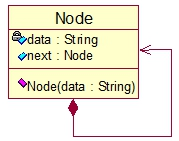
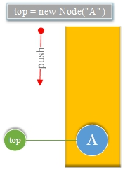
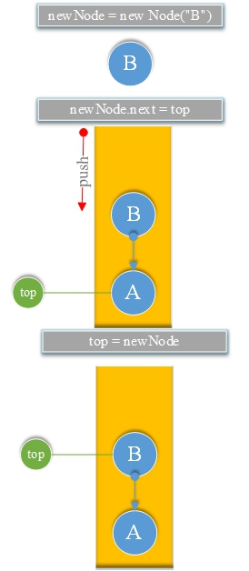
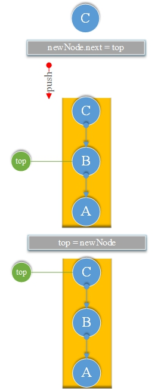
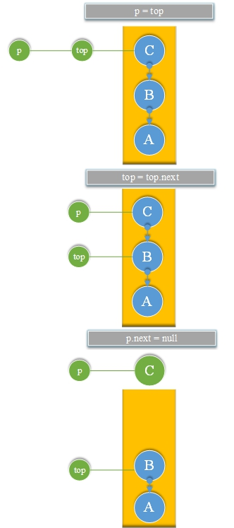
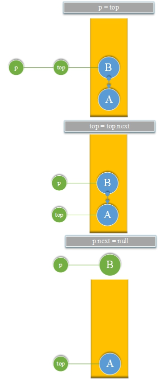
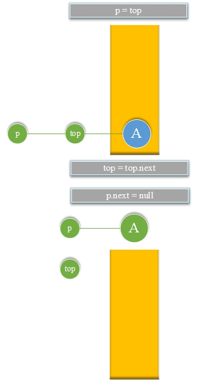

# 19.栈(Stack)

**Stack：**

FILO(先进后出)顺序。



**UML图**



```go
type Node struct {
	data string
	next *Node
}
```

**1.栈(Stack)<font color="red">初始化和遍历输出。</font>**

**将<font color="red">A</font>放入栈**



**将<font color="red">B</font>放入栈**



**将<font color="red">C</font>放入栈**



**如果从栈中取出<font color="red">C</font>:**



**如果从栈中取出<font color="red">B</font>:**



**如果从栈中取出<font color="red">A</font>:**



**Stack.go**

```go
package main
import "fmt"

type Node struct {
	data string
	next *Node
}

var top *Node = nil
var size int

func push(element string ) {
	if top == nil {
		top = new (Node)
		top.data = element
	} else {
		var newNode *Node = new (Node)
		newNode.data = element
		newNode.next = top
		top = newNode
	}
	size++
}

func pop() *Node {
	if top == nil {
		return nil
	}
	var p = top
	top = top.next // top move down
	p.next = nil
	size--
	return p
}

func output() {
	fmt.Printf("Top " )
	var node *Node = nil
	for {
		node = pop()
		if node == nil {
			break
		}
		fmt.Printf("%s -> " , node.data)
	}
	fmt.Printf("End\n" )
}

func main() {
	push("A" )
	push("B" )
	push("C" )
	push("D" )
	output()
}
```

**结果：**

```
Top D -> C -> B -> A -> End
```

