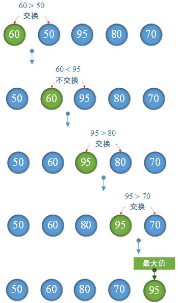

# 2.最大值

## 整数序列最大值


**1.算法思想：**

比较<font color="red">arrays[i]</font>与<font color="red">arrays[i+1]</font>，如果<font color="red">arrays[i]</font>><font color="red">arrays[i+1]</font> 则交换。因此，继续进行比较直到最后一个数字<font color="red">arrays [length-1]</font>最大。



**TestMaxValue.go**

```go
package main

import "fmt"

func max(arrays []int,length int) int  {
	for i := 0; i < length-1; i++ {
		if arrays[i]>arrays[i+1] {//交换
			var temp = arrays[i]
			arrays[i]=arrays[i+1]
			arrays[i+1]=temp
		}
	}
	var maxValue=arrays[length-1]
	return maxValue
}
func main()  {
	var scores=[]int{60,50,95,80,70}
	var length=len(scores)
	var maxValue=max(scores,length)
	fmt.Printf("最大值= %d\n",maxValue)
}
```

**结果：**

```
最大值= 95
```

