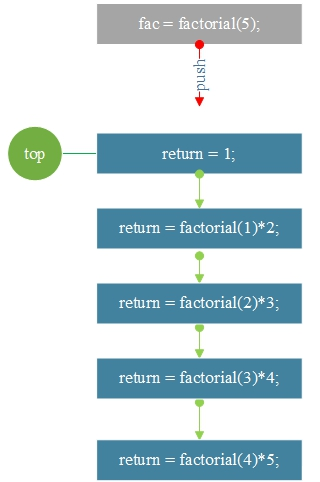

# 20.递归算法

**递归算法：**

程序函数本身将调用其自身的层以继续进行，直到达到特定条件，然后逐步返回到结尾。

**1. n的阶乘：n \*（n-1）\*（n-2）...... \* 2 \* 1**

**TestFactorial.go**

```go
package main

import "fmt"

func factorial(n int) int {
	if n==1{
		return 1
	}else {
		return factorial(n-1)*n//递归地调用自己，直到返回结束
	}
}

func main() {
	var n=5
	var fac =factorial(n)
	fmt.Printf("5的阶乘是：%d",fac)
}
```

**结果：**

```
5的阶乘是：120
```


**图形分析：**



