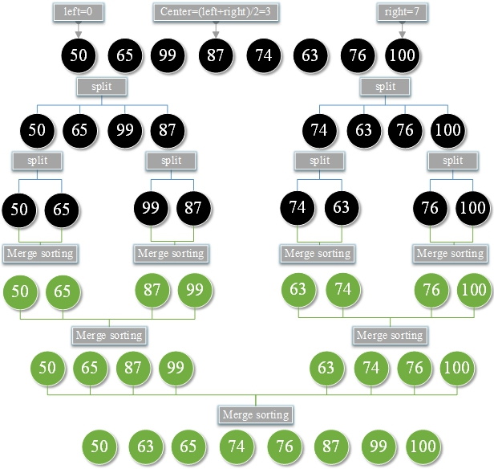

# 21.二路归并算法

**二路归并算法：**

排序上半部分和下半部分的数据，并将两个有序子列表合并为一个有序列表，然后继续递归进行到末尾。

**1.** **按归并排序分数<font color="red">{50，65，99，87，74，63，76，100}</font>**



**TestMergeSort.go**

```go
package main

import (
	"fmt"
)

func main(){
	var scores=[]int{50,65,99,87,74,63,76,100,92}
	var length=len(scores)

	sort(scores,length)

	for i := 0; i < length; i++ {
		fmt.Printf("%d,",scores[i])
	}
}

func sort(array[]int,length int)  {
	var temp=make([]int,length)
	mergeSort(array,temp,0,length-1)
}

func mergeSort(array []int, temp []int, left int, right int)  {
	if left<right{
		var center=(left+right)/2
		mergeSort(array,temp,left,center)//左边归并排序
		mergeSort(array,temp,center+1,right)//右边归并排序
		merge(array,temp,left,center+1,right)//合并两边数组
	}
}
/*
将两个有序列表合并成一个有序列表
temp：零时数组
left：左边开始的下标
right：右边开始的下标
rightEndIndex：右边结束的下标
*/
func merge(array []int,temp []int,left int,right int,rightEndIndex int)  {
	var leftEndIndex=right-1//左边结束的下标
	var tempIndex=left//从左边开始计数
	var elementNumber=rightEndIndex-left+1
	
	for{
		if left>leftEndIndex|| right>rightEndIndex{
			break
		}
		if array[left]<=array[right]{
			temp[tempIndex]=array[left]
			tempIndex++
			left++
		}else{
			temp[tempIndex]=array[right]
			tempIndex++
			right++
		}
	}
	
	for{
		if left>leftEndIndex{
			break
		}
		temp[tempIndex]=array[left]//如果左边有元素
		tempIndex++
		left++
	}
	
	for{
		if right>rightEndIndex {
			break
		}
		temp[tempIndex]=array[right]//如果右边有元素
		tempIndex++
		right++
	}
	for i := 0; i < elementNumber; i++ {
		array[rightEndIndex]=temp[rightEndIndex]
		rightEndIndex--
	}
}
```

**结果：**

```
50,63,65,74,76,87,92,99,100,
```

