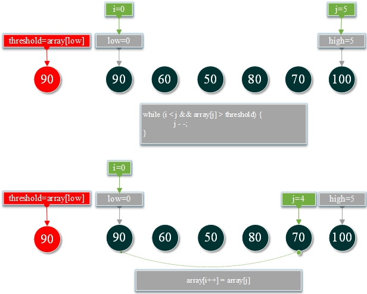
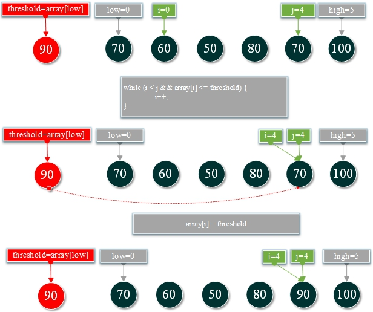
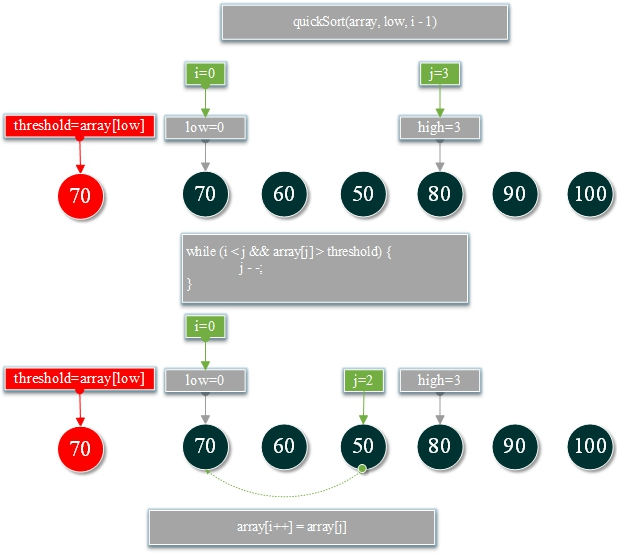
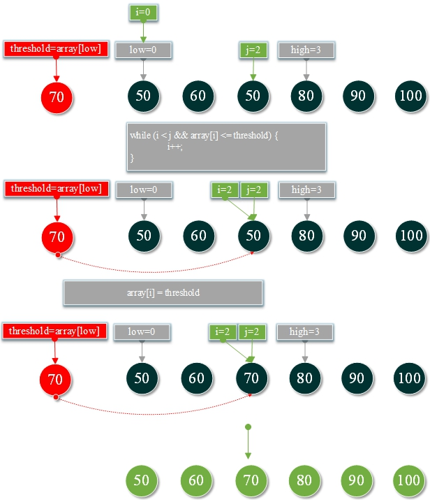

# 22.快速排序算法

**快速排序算法：**

快速排序是一种流行的排序算法，在实践中通常比其他排序算法要快。它利用分而治之的策略，通过将一个大数组分为两个较小的数组，对数据项进行快速排序。

**1.按快速排序排分数<font color="red">{90，60，50，80，70，100}</font>**









**TestQuickSort.go**

```go
package main

import "fmt"

func main(){
	var scores=[]int{50,65,99,87,74,63,76,76,100,92}
	var length=len(scores)

	sort(scores,length)
	for i:=0;i<length;i++{
		fmt.Printf("%d,",scores[i])
	}
}

func sort(array []int,length int)  {
	if length>0{
		quickSort(array,0,length-1)
	}
}

func quickSort(array []int , low int , high int ) {
	if low > high {
		return
	}
	var i = low
	var j = high
	var threshold = array[low]
	// 轮流从列表的两端扫描
	for {
		if i >= j {
			break
		}
		// 从右到左查找小于阈值的第一个位置
		for {
			if i >= j || array[j] <= threshold {
				break
			}
			j--
		}
		//用比阈值小的数字代替低值
		if i < j {
			array[i] = array[j]
			i++
		}
		// 从左到右查找大于阈值的第一个位置
		for {
			if i >= j || array[i] > threshold {
				break
			}
			i++
		}
		//用大于阈值的数字代替高值
		if i < j {
			array[j] = array[i]
			j--
		}
	}
	array[i] = threshold
	// 左边快速排序
	quickSort(array, low, i-1 )
	// 右边快速排序
	quickSort(array, i+1 , high)
}
```

**结果：**

```
50,63,65,74,76,76,87,92,99,100,
```

