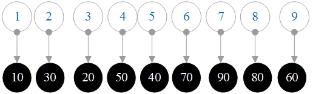

# 23.二叉树查找

**二叉树查找：**

1.如果任何节点的左子树都不为空，则左子树上所有节点的值小于其根节点的值；

2.如果任何节点的右子树不为空，则右子树上所有节点的值大于其根节点的值；

3.任何节点的左子树和右子树也是二叉搜索树。


**节点UML图**


```go
type Node struct {
data   int
left   *Node
right *Node
}
```

### 1.构造一个二叉树查找，插入节点

从根节点比较插入的节点，然后将比根节点小的节点与根节点的左子树进行比较，否则，与右子树进行比较，直到左子树为空或右子树为空，则为已插入。

**插入<font color="red">60</font>**


**插入<font color="red">40</font>**


**插入<font color="red">20</font>**


**插入<font color="red">10</font>**


**插入<font color="red">30</font>**


**插入<font color="red">50</font>**


**插入<font color="red">80</font>**


**插入<font color="red">70</font>**


**插入<font color="red">90</font>**


### 2.二叉树查找的<font color="red">In-order遍历</font>

<font color="red">In-order遍历</font>:左子树->根节点->右子树


**结果：**


**BinaryTreeInOrder.go**

```go
package main

import "fmt"

type Node struct{
	data int
	left *Node
	right *Node
}

var root *Node=nil

func createNewNode(newData int)*Node  {
	var newNode *Node=new(Node)
	newNode.data=newData
	newNode.left=nil
	newNode.right=nil
	return newNode
}

//按顺序遍历二叉树查找
func inOrder(root *Node)  {
	if root==nil{
		return
	}
	inOrder(root.left)//遍历左子树
	fmt.Printf("%d,",root.data)
	inOrder(root.right)//遍历右子树
}
func insert(node *Node,newData int)  {
	if root == nil {
		root = &Node{data: newData, left: nil , right: nil }
		return
	}
	var compareValue = newData - node.data
	//递归左子树，继续查找插入位置
	if compareValue < 0 {
		if node.left == nil {
			node.left = createNewNode(newData)
		} else {
			insert(node.left, newData)
		}
	} else if compareValue > 0 {
		//递归右子树，继续查找插入位置
		if node.right == nil {
			node.right = createNewNode(newData)
		} else {
			insert(node.right, newData)
		}
	}
}

func main() {
	//构造二叉树查找
	insert(root, 60 )
	insert(root, 40 )
	insert(root, 20 )
	insert(root, 10 )
	insert(root, 30 )
	insert(root, 50 )
	insert(root, 80 )
	insert(root, 70 )
	insert(root, 90 )
	fmt.Printf("In-order遍历二叉树查找 \n" )
	inOrder(root)
}
```

**结果：**

```
按顺序遍历二叉树查找
10,20,30,40,50,60,70,80,90,
```

### 3.二叉树查找的<font color="red">Pre-order遍历</font>

<font color="red">Pre-order遍历</font>:根节点->左子树->右子树


**结果：**


**BinaryTreePreOrder.go**

```go
package main
import "fmt"
type Node struct {
	data   int
	left   *Node
	right *Node
}
var root *Node = nil
func createNewNode(newData int ) *Node {
	var newNode *Node = new (Node)
	newNode.data = newData
	newNode.left = nil
	newNode.right = nil
	return newNode
}
//Preorder遍历二叉树搜索
func preOrder(root *Node) {
	if root == nil {
		return
	}
	fmt.Printf("%d, " , root.data)
	preOrder(root.left)   // 左子树的递归遍历
	preOrder(root.right) // 递归遍历右子树
}
func insert(node *Node, newData int ) {
	if root == nil {
		root = &Node{data: newData, left: nil , right: nil }
		return
	}
	var compareValue = newData - node.data
	//递归左子树，继续查找插入位置
	if compareValue < 0 {
		if node.left == nil {
			node.left = createNewNode(newData)
		} else {
			insert(node.left, newData)
		}
	} else if compareValue > 0 {
		//递归右子树，继续查找插入位置
		if node.right == nil {
			node.right = createNewNode(newData)
		} else {
			insert(node.right, newData)
		}
	}
}
func main() {
	//构造二叉树
	insert(root, 60 )
	insert(root, 40 )
	insert(root, 20 )
	insert(root, 10 )
	insert(root, 30 )
	insert(root, 50 )
	insert(root, 80 )
	insert(root, 70 )
	insert(root, 90 )
	fmt.Printf("Pre-order 遍历二叉树查找 \n" )
	preOrder(root)
}
```

**结果：**

```
Pre-order 遍历二叉树查找
60, 40, 20, 10, 30, 50, 80, 70, 90,
```


### 4.二叉树查找的<font color="red">Post-order遍历</font>

<font color="red">Post-order遍历</font>:右子树->根节点->左子树


**结果：**



**BinaryTreePostOrder.go**

```go
package main
import "fmt"
type Node struct {
	data   int
	left   *Node
	right *Node
}
var root *Node = nil
func createNewNode(newData int ) *Node {
	var newNode *Node = new (Node)
	newNode.data = newData
	newNode.left = nil
	newNode.right = nil
	return newNode
}
//Post-order 遍历二叉树查找
func postOrder(root *Node) {
	if root == nil {
		return
	}
	postOrder(root.left)   // 左子树的递归遍历
	postOrder(root.right) // 右子树的递归遍历
	fmt.Printf("%d, " , root.data)
}
func insert(node *Node, newData int ) {
	if root == nil {
		root = &Node{data: newData, left: nil , right: nil }
		return
	}
	var compareValue = newData - node.data
	//递归左子树，继续查找插入位置
	if compareValue < 0 {
		if node.left == nil {
			node.left = createNewNode(newData)
		} else {
			insert(node.left, newData)
		}
	} else if compareValue > 0 {
		//递归右子树，继续查找插入位置
		if node.right == nil {
			node.right = createNewNode(newData)
		} else {
			insert(node.right, newData)
		}
	}
}
func main() {
	//构造二叉树
	insert(root, 60 )
	insert(root, 40 )
	insert(root, 20 )
	insert(root, 10 )
	insert(root, 30 )
	insert(root, 50 )
	insert(root, 80 )
	insert(root, 70 )
	insert(root, 90 )
	fmt.Printf("Post-order 遍历二叉树查找 \n" )
	postOrder(root)
}
```

**结果：**

```
Post-order 遍历二叉树查找
10, 30, 20, 50, 40, 70, 90, 80, 60,
```

### 5.二叉树查找的<font color="red">最大值和最小值</font>

**最小值:**较小的值在左子节点上，只要递归遍历左子节点直到为空，当前节点就是最小节点。

**最大值:**大值在右子节点上，只要递归遍历是右子节点直到为空，当前节点就是最大节点。


**BinaryTreeMaxAndMin.go**

```go
package main
import "fmt"
type Node struct {
	data   int
	left   *Node
	right *Node
}
var root *Node = nil
func createNewNode(newData int ) *Node {
	var newNode *Node = new (Node)
	newNode.data = newData
	newNode.left = nil
	newNode.right = nil
	return newNode
}
func searchMinValue(node *Node) *Node { //最小值
	if node == nil || node.data == 0 {
		return nil
	}
	if node.left == nil {
		return node
	}
	return searchMinValue(node.left) //递归地从左子树中找到最小值
}
func searchMaxValue(node *Node) *Node { //最大值
	if node == nil || node.data == 0 {
		return nil
	}
	if node.right == nil {
		return node
	}
	return searchMaxValue(node.right) //递归地从右子树中找到最小值
}
func insert(node *Node, newData int ) {
	if root == nil {
		root = &Node{data: newData, left: nil , right: nil }
		return
	}
	var compareValue = newData - node.data
	//递归左子树，继续查找插入位置
	if compareValue < 0 {
		if node.left == nil {
			node.left = createNewNode(newData)
		} else {
			insert(node.left, newData)
		}
	} else if compareValue > 0 {
		//递归右子树，继续查找插入位置
		if node.right == nil {
			node.right = createNewNode(newData)
		} else {
			insert(node.right, newData)
		}
	}
}
func main() {
	//构建二叉树
	insert(root, 60 )
	insert(root, 40 )
	insert(root, 20 )
	insert(root, 10 )
	insert(root, 30 )
	insert(root, 50 )
	insert(root, 80 )
	insert(root, 70 )
	insert(root, 90 )
	fmt.Printf("\n最小值 \n" )
	var minNode = searchMinValue(root)
	fmt.Printf("%d" , minNode.data)
	fmt.Printf("\n最大值 \n" )
	var maxNode = searchMaxValue(root)
	fmt.Printf("%d" , maxNode.data)
}
```

**结果：**

```
最小值
10
最大值
90
```

### 6.二叉树查找<font color="red">删除节点</font>

二叉树查找删除节点3种情况

1.  如果没有子节点，直接删除它

2.  如果只有一个子节点，则子节点将替换当前节点，然后删除当前节点。

3. 如果有两个子节点，则用右边子树中的最小节点替换当前节点，因为右边的最小节点也比左边的值大。

1.如果没有子节点，直接删除它:<font color="red">删除节点10</font>


2.如果只有一个子节点，则子节点将替换当前节点，然后删除当前节点。<font color="red">删除节点20</font>


3.如果有两个子节点，则用右子树中的最小节点替换当前节点，<font color="red">删除节点40</font>


**BinaryTreeDelete.go**

```go
package main

import "fmt"

type Node struct {
	data int
	left *Node
	right *Node
}
var root *Node = nil
func createNewNode(newData int) *Node {
	var newNode *Node = new(Node)
	newNode.data = newData
	newNode.left = nil
	newNode.right = nil
	return newNode
}
func searchMinValue(node *Node) *Node { //最小值
	if node == nil || node.data == 0 {
		return nil
	}
	if node.left == nil {
		return node
	}
	return searchMinValue(node.left) //递归地寻找最小值 从左子树开始

}
// 按顺序遍历二叉搜索树
func inOrder(root *Node) {
	if root == nil {
		return
	}
	inOrder(root.left) // 遍历左子树
	fmt.Printf("%d, ", root.data)
	inOrder(root.right) // 遍历右子树
}
func removeNode(node *Node, newData int) *Node {
	if node == nil {
		return node
	}
	var compareValue = newData - node.data
	if compareValue > 0 {
		node.right = removeNode(node.right, newData)
	} else if compareValue < 0 {
		node.left = removeNode(node.left, newData)
	} else if node.left != nil && node.right != nil {
		//找到右子树的最小节点来替换当前节点 节点
		node.data = searchMinValue(node.right).data
		node.right = removeNode(node.right, node.data)
	} else {
		if node.left != nil {
			node = node.left
		} else {
			node = node.right
		}
	}
	return node
}
func insert(node *Node, newData int) {
	if root == nil {
		root = &Node{data: newData, left: nil, right: nil}
		return
	}
	var compareValue = newData - node.data
	//递归左子树，继续查找插入位置
	if compareValue < 0 {
		if node.left == nil {
			node.left = createNewNode(newData)
		} else {
			insert(node.left, newData)
		}
	} else if compareValue > 0 {//递归右子树
		if node.right == nil {
			node.right = createNewNode(newData)
		} else {
			insert(node.right, newData)
		}
	}
}
func main() {
	//构建二叉树
	insert(root, 60)
	insert(root, 40)
	insert(root, 20)
	insert(root, 10)
	insert(root, 30)
	insert(root, 50)
	insert(root, 80)
	insert(root, 70)
	insert(root, 90)
	fmt.Printf("\n删除节点: 10 \n")
	removeNode(root, 10)
	fmt.Printf("\nIn-order 遍历二叉树 \n")
	inOrder(root)
	fmt.Printf("\n--------------------------------------------\n")
	fmt.Printf("\n删除节点: 20 \n")
	removeNode(root, 20)
	fmt.Printf("\nIn-order 遍历二叉树 \n")
	inOrder(root)
	fmt.Printf("\n--------------------------------------------\n")
	fmt.Printf("\n删除节点: 40 \n")
	removeNode(root, 40)
	fmt.Printf("\nIn-order 遍历二叉树 \n")
	inOrder(root)
}
```

**结果：**

```
删除节点: 10

In-order 遍历二叉树
20, 30, 40, 50, 60, 70, 80, 90,
--------------------------------------------

删除节点: 20

In-order 遍历二叉树
30, 40, 50, 60, 70, 80, 90,
--------------------------------------------

删除节点: 40

In-order 遍历二叉树
30, 50, 60, 70, 80, 90,
```

