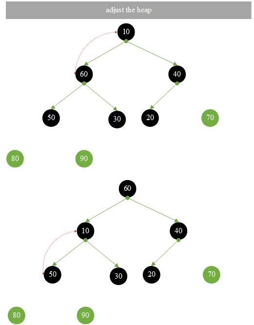

# 24.二叉堆排序

**二叉堆排序:**

二叉树中非终端节点的值不大于其左子节点和右子节点的值。

小顶堆:ki <= k2i和ki <= k2i+1

大顶堆:ki >= k2i和ki >= k2i+1

父节点下标= (i-1)/2

左子节点下标= 2*i+1

右子节点下标= 2*i+2

**堆排序的过程:**

1. 建立一个堆

2. 输出堆的顶部元素后，从上到下进行调整，将顶部元素与其左右子树的根节点进行比较，将最小的元素交换到堆的顶部;然后不断调整，直到叶子节点获得新的堆。

### 1.<font color="red">{10, 90, 20, 80, 30, 70, 40, 60, 50}</font>构建堆，然后进行堆排序输出

**初始化堆并构建堆**


**创建堆完成**

### 2.开始堆排序





**堆排序的结果**

**HeapSort.go**

```go
package main

import "fmt"

//调整堆
func adjustHeap(array []int , currentIndex int , maxLength int ) {
	var noLeafValue = array[currentIndex] // 目前非叶节点
	//2 * currentIndex + 1   当前左子树下标
	for j := 2 *currentIndex + 1 ; j <= maxLength; j = currentIndex*2 + 1 {
		if j < maxLength && array[j] < array[j+1 ] {
			j++ // j 大的下标
		}
		if noLeafValue >= array[j] {
			break
		}
		array[currentIndex] = array[j] // 向上移动到父节点
		currentIndex = j
	}
	array[currentIndex] = noLeafValue // 放到位置上
}

//初始化堆
func createHeap(array []int , length int ) {
	// 建立一个堆, (length - 1) / 2 扫描一半的子节点
	for i := (length - 1 ) / 2 ; i >= 0 ; i-- {
		adjustHeap(array, i, length-1 )
	}
}

func heapSort(array []int , length int ) {
	for i := length - 1 ; i > 0 ; i-- {
		var temp = array[0 ]
		array[0 ] = array[i]
		array[i] = temp
		adjustHeap(array, 0 , i-1 )
	}
}

func main() {
	var scores = []int {10 , 90 , 20 , 80 , 30 , 70 , 40 , 60 , 50 }
	var length = len (scores)
	fmt.Printf("在建立堆之前 : \n" )
	for i := 0 ; i < length; i++ {
		fmt.Printf("%d, " , scores[i])
	}
	fmt.Printf("\n\n" )
	fmt.Printf("在建立堆之后 : \n" )
	createHeap(scores, length)
	for i := 0 ; i < length; i++ {
		fmt.Printf("%d, " , scores[i])
	}
	fmt.Printf("\n\n" )
	fmt.Printf("堆排序 : \n" )
	heapSort(scores, length)
	for i := 0 ; i < length; i++ {
		fmt.Printf("%d, " , scores[i])
	}
}
```

**结果：**

```
在建立堆之前 :
10, 90, 20, 80, 30, 70, 40, 60, 50,

在建立堆之后 :
90, 80, 70, 60, 30, 20, 40, 10, 50,

堆排序 :
10, 20, 30, 40, 50, 60, 70, 80, 90,
```

