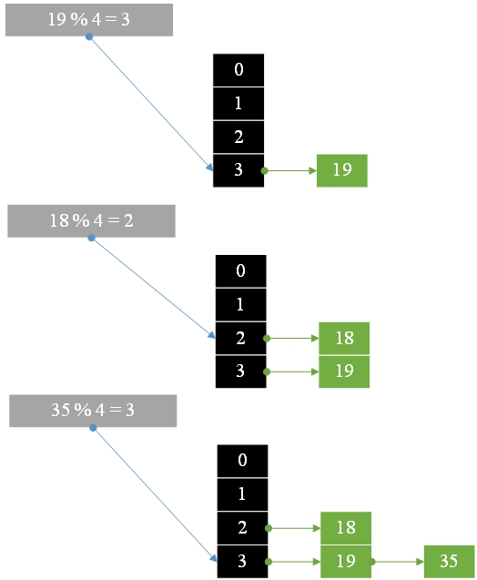
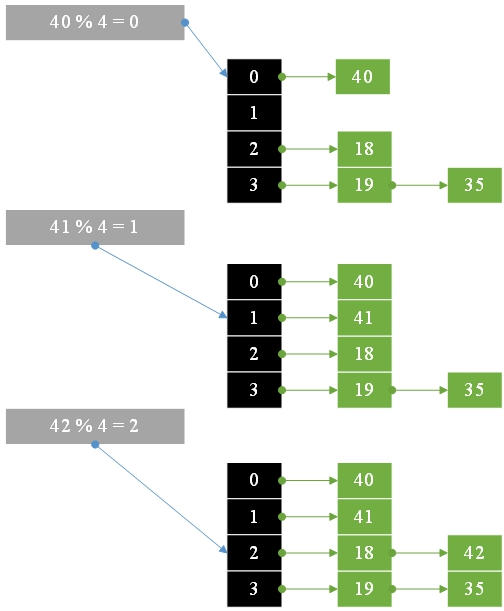
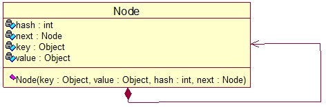

# 25.哈希表

**哈希表：**

通过映射表中的key=>values进行访问。

### 1. 将<font color="red">{19,18,35,40,41,42}</font>映射到哈希表映射规则<font color="red">key% 4</font>





### 2.实现一个哈希表



```go
type Node struct {
	key    string
	value string
	hash   int
	next   *Node
}
```

**Hashtable.go**

```go
package main

import (
	"fmt"
	"math"
	"strings"
)

type Node struct {
	key    string
	value string
	hash   int
	next   *Node
}

const CAPACITY = 16

var table = make ([]*Node, CAPACITY)
var size int

func isEmpty() bool {
	if size == 0 {
		return true
	} else {
		return false
	}
}

func hashCode(key string ) int {
	var num = 0
	var length = len (key)
	for i := 0 ; i < length; i++ {
		num += int (key[i])
	}
	//hash strategy is to take the square in the middle
	//
	var avg = num * int ((math.Pow(5.0 , 0.5 ) - 1 )) / 2
	var numeric = avg - int (math.Floor(float64 (avg)))
	return int (math.Floor(float64 (numeric * CAPACITY)))
}

func put(key string , value string ) {
	var hash = hashCode(key)
	var newNode *Node = new (Node)
	newNode.key = key
	newNode.value = value
	newNode.hash = hash
	newNode.next = nil
	var node = table[hash]
	for {
		if node == nil {
			break
		}
		if strings.Compare(node.key, key) == 0 {
			node.value = value
			return
		}
		node = node.next
	}
	newNode.next = table[hash]
	table[hash] = newNode
	size++
}

func get(key string ) string {
	if key == "" {
		return ""
	}
	var hash = hashCode(key)
	var node = table[hash]
	for {
		if node == nil {
			break
		}
		if strings.Compare(node.key, key) == 0 {
			return node.value
		}
		node = node.next
	}
	return ""
}

func main() {
	put("david" , "Good Boy Keep Going" )
	put("grace" , "Cute Girl Keep Going" )
	fmt.Printf("david => %s \n" , get("david" ))
	fmt.Printf("grace => %s \n" , get("grace" ))
}
```

**结果：**

```
david => Good Boy Keep Going
grace => Cute Girl Keep Going
```

