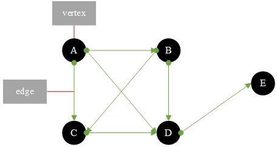
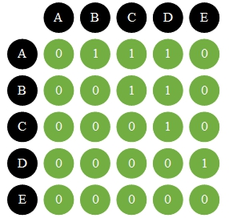
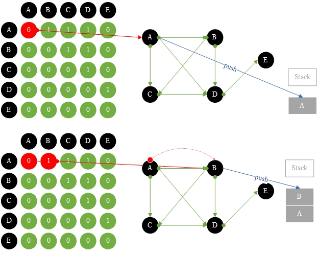
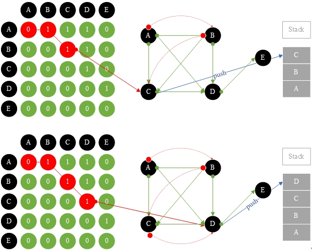
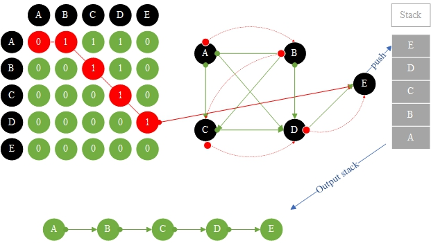

# 26.1.有向图和深度优先搜索

**有向图:**

数据结构由一个邻接矩阵(即一个二维数组)和一个邻接表表示。每个节点称为顶点，两个相邻的节点称为边。

有向图有方向:<font color="red">A - >b和B -> A是不同的</font>



### 1. 邻接矩阵如上所述:

顶点的总数是一个二维数组大小，如果有值的边是<font color="red">1</font>，否则没有值的边是<font color="red">0</font>。



2. 深度优先搜索:

从A处查找相邻边节点B，从B处查找相邻边节点C，以此类推，直到找到所有节点<font color="red">A -> B -> C -> D -> E</font>。







**Graph.go**

```go
package main

import "fmt"

const MAX_VERTEX_SIZE = 5
const STACKSIZE = 1000

type Vertex struct {
	data     string
	visited bool // 你有没有去过
}

var top = -1 // 栈保存当前的顶点
var stacks = make ([]int , STACKSIZE)

func push(element int ) {
	top++
	stacks[top] = element
}

func pop() int {
	if top == -1 {
		return -1
	}
	var data = stacks[top]
	top--
	return data
}

func peek() int {
	if top == -1 {
		return -1
	}
	var data = stacks[top]
	return data
}

func isEmpty() bool {
	if top <= -1 {
		return true
	}
	return false
}
////// stack end //////////////////////////

var size = 0 // 当前顶点大小
var vertexs = make ([]Vertex, MAX_VERTEX_SIZE)
var adjacencyMatrix [MAX_VERTEX_SIZE][MAX_VERTEX_SIZE]int

func addVertex(data string ) {
	var vertex Vertex
	vertex.data = data
	vertex.visited = false
	vertexs[size] = vertex
	size++
}

func addEdge(from int , to int ) {// 添加邻边
	adjacencyMatrix[from][to] = 1 // A -> B != B -> A
}

func clear() {
	for i := 0 ; i < size; i++ {
		vertexs[i].visited = false
	}
}

func depthFirstSearch() {
	vertexs[0 ].visited = true // 从第一个顶点开始搜索
	fmt.Printf("%s" , vertexs[0 ].data)
	push(0 )
	for {
		if isEmpty() {
			break
		}
		var row = peek()
		// 获取尚未访问的相邻顶点位置
		var col = findAdjacencyUnVisitedVertex(row)
		if col == -1 {
			pop()
		} else {
			vertexs[col].visited = true
			fmt.Printf(" -> %s" , vertexs[col].data)
			push(col)
		}
	}
	clear()
}

// 获取尚未访问的相邻顶点位置
func findAdjacencyUnVisitedVertex(row int ) int {
	for col := 0 ; col < size; col++ {
		if adjacencyMatrix[row][col] == 1 && !vertexs[col].visited {
			return col
		}
	}
	return -1
}

func printGraph() {
	fmt.Printf("二维数组遍历顶点边和相邻数组 :    \n     " )
	for i := 0 ; i < MAX_VERTEX_SIZE; i++ {
		fmt.Printf("%s    " , vertexs[i].data)
	}
	fmt.Printf("\n" )
	for i := 0 ; i < MAX_VERTEX_SIZE; i++ {
		fmt.Printf("%s    " , vertexs[i].data)
		for j := 0 ; j < MAX_VERTEX_SIZE; j++ {
			fmt.Printf("%d    " , adjacencyMatrix[i][j])
		}
		fmt.Printf("\n" )
	}
}

func main() {
	addVertex("A" )
	addVertex("B" )
	addVertex("C" )
	addVertex("D" )
	addVertex("E" )
	addEdge(0 , 1 )
	addEdge(0 , 2 )
	addEdge(0 , 3 )
	addEdge(1 , 2 )
	addEdge(1 , 3 )
	addEdge(2 , 3 )
	addEdge(3 , 4 )
	// 二维数组遍历输出顶点边和相邻数组
	printGraph()
	fmt.Printf("\n深度优先的搜索遍历输出 : \n" )
	depthFirstSearch()
}
```

**结果：**

```
二维数组遍历顶点边和相邻数组 :
     A    B    C    D    E
A    0    1    1    1    0
B    0    0    1    1    0
C    0    0    0    1    0
D    0    0    0    0    1
E    0    0    0    0    0

深度优先的搜索遍历输出 :
A -> B -> C -> D -> E
```

