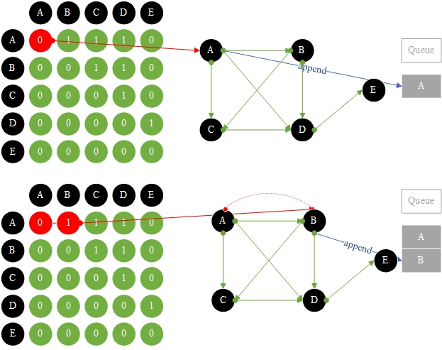
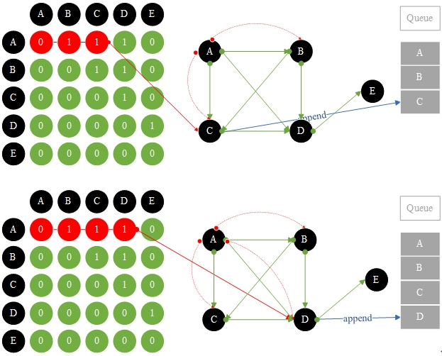
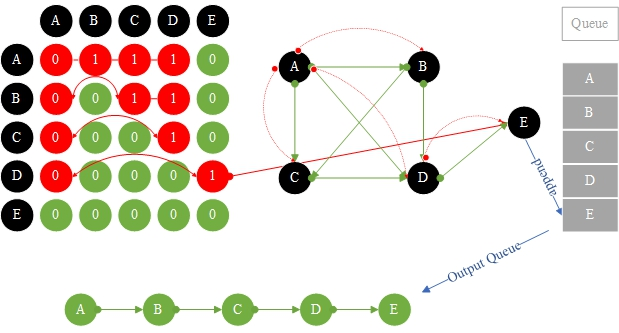

# 26.2.有向图和广度优先搜索

**广度优先搜索:**

从A中找出所有相邻的边结点B, C, D，然后从B中找出所有相邻的边结点A, C, D，依此类推，直到找到所有的结点<font color="red"> B -> C -> D -> E</font>。







**Graph2.go**

```go
package main
import "fmt"
const MAX_VERTEX_SIZE = 5
// 队列保存当前的顶点
const QUEUESIZE = 40
type Queue struct {
	queue [QUEUESIZE]int
	head int
	tail int
}
var q *Queue = nil
func initQueue() {
	q = new(Queue)
	q.head = 0
	q.tail = 0
}
func isQueueEmpty() bool {
	if q.head == q.tail {
		return true
	} else {
		return false
	}
}
func enQueue(data int) bool {
	if q.tail == QUEUESIZE {
		fmt.Printf("队列已满，无法加入.\n")
		return false
	}
	q.queue[q.tail] = data
	q.tail++
	return true
}
func deleteQueue() int {
	if q.head == q.tail {
		fmt.Printf("队列为空，无法加入.\n")
	}
	var data = q.queue[q.head]
	q.head++
	return data
}
////// queue end //////////////////////////
type Vertex struct {
	data string
	visited bool // 你有没有去过
}
var size = 0 // 当前顶点大小
var vertexs [MAX_VERTEX_SIZE]Vertex
var adjacencyMatrix [MAX_VERTEX_SIZE][MAX_VERTEX_SIZE]int
func addVertex(data string) {
	var vertex Vertex
	vertex.data = data
	vertex.visited = false
	vertexs[size] = vertex
	size++
}
// 添加邻边
func addEdge(from int, to int) {
	// A -> B != B -> A
	adjacencyMatrix[from][to] = 1
}
// 清除重置
func clear() {
	for i := 0; i < size; i++ {
		vertexs[i].visited = false
	}
}
func breadthFirstSearch() {
	// 从第一个顶点开始搜索
	vertexs[0].visited = true
	fmt.Printf("%s", vertexs[0].data)
	enQueue(0)
	var col int
	for {
		if isQueueEmpty() {
			break
		}
		var row = deleteQueue()
		// 获取尚未访问的相邻顶点位置
		col = findAdjacencyUnVisitedVertex(row)
		//循环连接到当前顶点的所有顶点
		for {
			if col == -1 {
				break
			}
			vertexs[col].visited = true
			fmt.Printf(" -> %s", vertexs[col].data)
			enQueue(col)
			col = findAdjacencyUnVisitedVertex(row)
		}
	}
	clear()
}
// 获取尚未访问的相邻顶点位置
func findAdjacencyUnVisitedVertex(row int) int {
	for col := 0; col < size; col++ {
		if adjacencyMatrix[row][col] == 1 && !vertexs[col].visited {
			return col
		}
	}
	return -1
}
func printGraph() {
	fmt.Printf("二维数组遍历顶点边和邻边数组 : \n ")
	for i := 0; i < MAX_VERTEX_SIZE; i++ {
		fmt.Printf("%s ", vertexs[i].data)
	}
	fmt.Printf("\n")
	for i := 0; i < MAX_VERTEX_SIZE; i++ {
		fmt.Printf("%s ", vertexs[i].data)
		for j := 0; j < MAX_VERTEX_SIZE; j++ {
			fmt.Printf("%d ", adjacencyMatrix[i][j])
		}
		fmt.Printf("\n")
	}
}
func main() {
	initQueue()
	addVertex("A")
	addVertex("B")
	addVertex("C")
	addVertex("D")
	addVertex("E")
	addEdge(0, 1)
	addEdge(0, 2)
	addEdge(0, 3)
	addEdge(1, 2)
	addEdge(1, 3)
	addEdge(2, 3)
	addEdge(3, 4)
	// 二维数组遍历顶点边和邻边数组
	printGraph()
	fmt.Printf("\n广度优先的搜索遍历输出 : \n")
	breadthFirstSearch()
}
```

**结果：**

```
二维数组遍历顶点边和邻边数组 :
 A B C D E
A 0 1 1 1 0
B 0 0 1 1 0
C 0 0 0 1 0
D 0 0 0 0 1
E 0 0 0 0 0

广度优先的搜索遍历输出 :
A -> B -> C -> D -> E
```

