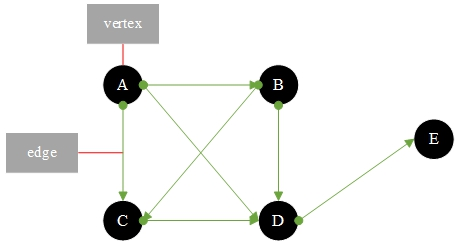
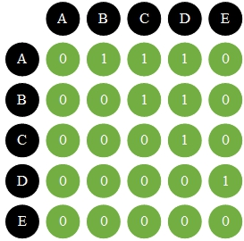
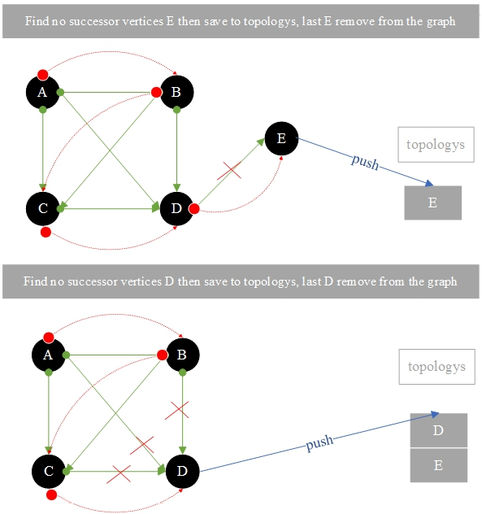
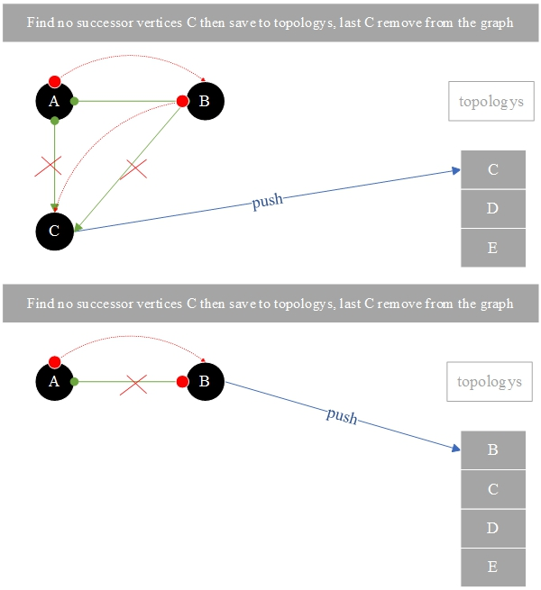
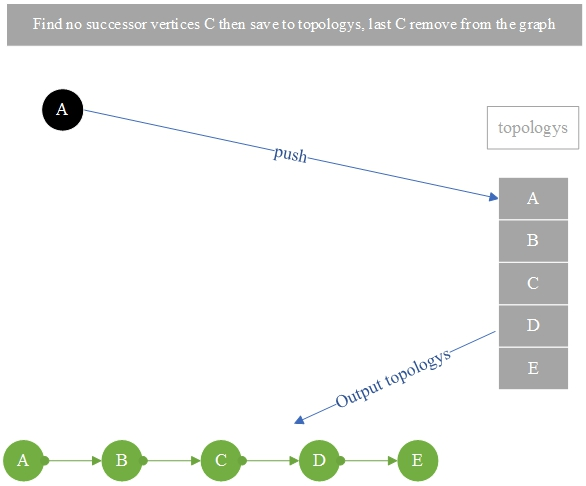

# 26.3.有向图拓扑排序

**有向图拓扑排序:**

按方向顺序对有向图中的顶点排序

有向图有方向:<font color="red">A - >b和B -> A是不同的</font>



### 1. 邻接矩阵如上所述:

顶点的总数是一个二维数组大小，如果有值的边是<font color="red">1</font>，否则没有值的边是<font color="red">0</font>。



顶点A的拓扑排序:<font color="red">A -> B -> C -> D -> E</font>







**Topology.go**

```go
package main
import "fmt"
const MAX_VERTEX_SIZE = 5
const STACKSIZE = 1000
type Vertex struct {
	data string
	visited bool // 你有没有去过
}
// 栈保存当前的顶点
var top = -1
var stacks [STACKSIZE]int
func push(element int) {
	top++
	stacks[top] = element
}
func pop() int {
	if top == -1 {
		return -1
	}
	var data = stacks[top]
	top--
	return data
}
func peek() int {
	if top == -1 {
		return -1
	}
	var data = stacks[top]
	return data
}
func isEmpty() bool {
	if top <= -1 {
		return true
	}
	return false
}
var size = 0 // 当前顶点大小
var vertexs [MAX_VERTEX_SIZE]Vertex
// 拓扑排序结果数组，记录每个节点的排序序号。
var topologys [MAX_VERTEX_SIZE]Vertex
var adjacencyMatrix [MAX_VERTEX_SIZE][MAX_VERTEX_SIZE]int
func addVertex(data string) {
	var vertex Vertex
	vertex.data = data
	vertex.visited = false
	vertexs[size] = vertex
	size++
}
// 添加邻边
func addEdge(from int, to int) {
	// A -> B = B -> A
	adjacencyMatrix[from][to] = 1
}
func removeVertex(vertex int) {
	if vertex != size-1 {
		//如果顶点是最后一个元素，则结束
		for i := vertex; i < size-1; i++ { // 从顶点数组中删除顶点
			vertexs[i] = vertexs[i+1]
		}
		for row := vertex; row < size-1; row++ {
			// move up a row
			for col := 0; col < size-1; col++ {
				adjacencyMatrix[row][col] = adjacencyMatrix[row+1][col]
			}
		}
		for col := vertex; col < size-1; col++ { // 向左移动一行
			for row := 0; row < size-1; row++ {
				adjacencyMatrix[row][col] = adjacencyMatrix[row][col+1]
			}
		}
	}
	size-- // 减少顶点的数量
}
func topologySort() {
	for {
		if size <= 0 {
			break
		}
		var noSuccessorVertex = getNoSuccessorVertex() // 获取一个无后继节点
		if noSuccessorVertex == -1 {
			fmt.Printf("There is ring in Graph \n")
			return
		}
		topologys[size-1] = vertexs[noSuccessorVertex] // 将删除的节点复制到排序后的数组中
		removeVertex(noSuccessorVertex) // 不删除后继节点
	}
}
func getNoSuccessorVertex() int {
	var existSuccessor = false
	for row := 0; row < size; row++ {
		// 为每个顶点
		existSuccessor = false
		//如果节点有一个固定的行，那么每个列都有一个1，表示节点有一个后继，结束循环
		for col := 0; col < size; col++ {
			if adjacencyMatrix[row][col] == 1 {
				existSuccessor = true
				break
			}
		}
		if !existSuccessor {
			// 如果节点没有后继，则返回它的下标
			return row
		}
	}
	return -1
}
func printGraph() {
	fmt.Printf("二维数组遍历顶点边和相邻数组 : \n ")
	for i := 0; i < MAX_VERTEX_SIZE; i++ {
		fmt.Printf("%s ", vertexs[i].data)
	}
	fmt.Printf("\n")
	for i := 0; i < MAX_VERTEX_SIZE; i++ {
		fmt.Printf("%s ", vertexs[i].data)
		for j := 0; j < MAX_VERTEX_SIZE; j++ {
			fmt.Printf("%d ", adjacencyMatrix[i][j])
		}
		fmt.Printf("\n")
	}
}
func main() {
	addVertex("A")
	addVertex("B")
	addVertex("C")
	addVertex("D")
	addVertex("E")
	addEdge(0, 1)
	addEdge(0, 2)
	addEdge(0, 3)
	addEdge(1, 2)
	addEdge(1, 3)
	addEdge(2, 3)
	addEdge(3, 4)
	// 二维数组遍历顶点边和相邻数组
	printGraph()
	fmt.Printf("\n深度优先的搜索遍历输出 : \n")
	fmt.Printf("有向图拓扑排序: \n")
	topologySort()
	for i := 0; i < MAX_VERTEX_SIZE; i++ {
		fmt.Printf("%s -> ", topologys[i].data)
	}
}
```

结果：

```
二维数组遍历顶点边和相邻数组 :
 A B C D E
A 0 1 1 1 0
B 0 0 1 1 0
C 0 0 0 1 0
D 0 0 0 0 1
E 0 0 0 0 0

深度优先的搜索遍历输出 :
有向图拓扑排序:
A -> B -> C -> D -> E ->
```

