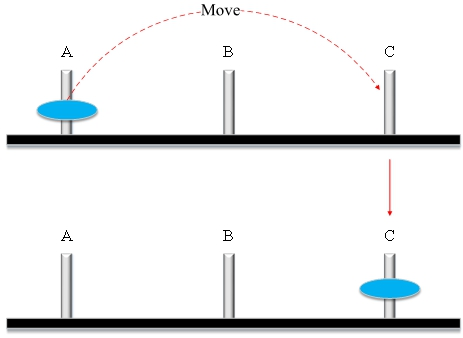
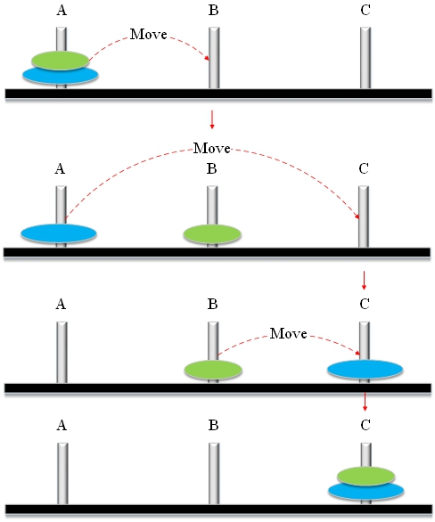
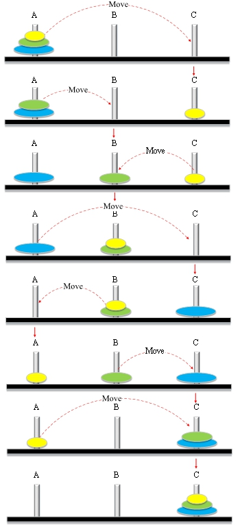

# 27.汉诺塔

1883年，法国人克劳斯(卢卡斯)从泰国到法国的汉诺塔。汉诺塔由三根钻石柱子支撑。一开始，上帝在第一根柱子上从上到下放了64个金圆盘。上帝命令僧侣们将所有的金盘从第一根柱子移到第三根柱子上。原理大板下小板在搬运过程中。如果每天只移动一块钢板，塔就会被摧毁。当所有的圆盘都移动了，那就是世界末日了。

**让我们把这个故事变成一个算法:**

将三栏标为ABC。

1. 如果只有一个盘，把它直接移动到C (<font color="red">A->C</font>)。

2. 当有两个盘时，用B作为辅助(<font color="red">A- >b, A->C,B->C</font>)。

3. 如果有两个以上的圆盘，用B作为辅助(<font color="red">A->B, A->C,B->C</font>)，继续递归处理。

### 1.如果只有一个磁盘，把它直接移动到C (<font color="red">A->C</font>)。



### 2. 当有两个盘时，用B作为辅助(<font color="red">A- >b, A->C,B->C</font>)。



### 3.如果超过两个圆盘，则使用B作为辅助，并继续递归处理。



**TowersOfHanoi.go**

```go
package main

import "fmt"

func hanoi(n int , A string , B string , C string ) {
	if n == 1 {
		fmt.Printf("移动 %d 号 %s 到 %s \n" , n, A, C)
	} else {
		hanoi(n-1 , A, C, B) //移动A上的第n-1个圆盘    通过C到B
		fmt.Printf("移动 %d 号从 %s to %s \n" , n, A, C)
		hanoi(n-1 , B, A, C) //移动B上的第n-1个圆盘    通过A到C
	}
}

func main() {
	fmt.Printf("请输入盘的数量 : \n" )
	var n int
	fmt.Scanf("%d" , &n)
	hanoi(n, "A" , "B" , "C" )
}
```

**结果：**

```
请输入盘的数量 :
1
移动 1 号 A 到 C

请输入盘的数量 :
2
移动 1 号 A 到 B
移动 2 号从 A to C
移动 1 号 B 到 C

请输入盘的数量 :
3
移动 1 号 A 到 C
移动 2 号从 A to B
移动 1 号 C 到 B
移动 3 号从 A to C
移动 1 号 B 到 A
移动 2 号从 B to C
移动 1 号 A 到 C
```

