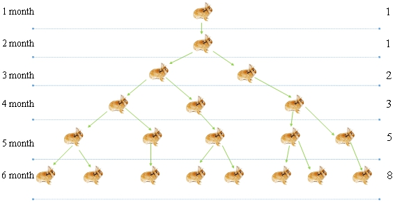

# 28.斐波那契

**斐波那契（Fibonacci）：** 1200年代的欧洲数学家，他在著作中写道：“如果有兔子

一个月后即可诞生一只新生兔。最初只有1只兔子，一个月后仍然有1只兔子。两个月后有2只兔子，三个月后有3只兔子……

例如：<font color="red">1、1、2、3、5、8、13 ...</font>

**斐波那契数列的定义:**

if n = 0, 1

   fn = n

if n > 1

   fn = fn-1 + fn-2



**Fibonacci.go**

```go
package main

import "fmt"

func fibonacci(n int ) int {
	if n == 1 || n == 2 {
		return 1
	} else {
		return fibonacci(n-1 ) + fibonacci(n-2 )
	}
}
func main() {
	fmt.Printf("请输入月数 : \n" )
	var number int
	fmt.Scanf("%d" , &number)
	for i := 1 ; i <= number; i++ {
		fmt.Printf("%d 个月: %d \n" , i, fibonacci(i))
	}
}
```

**结果：**

```
请输入月数 :
7
1 个月: 1
2 个月: 1
3 个月: 2
4 个月: 3
5 个月: 5
6 个月: 8
7 个月: 13
```

