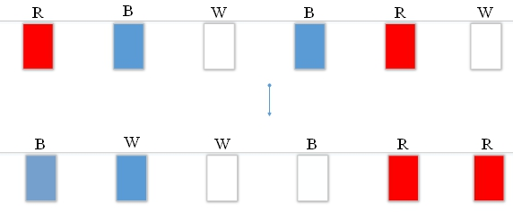
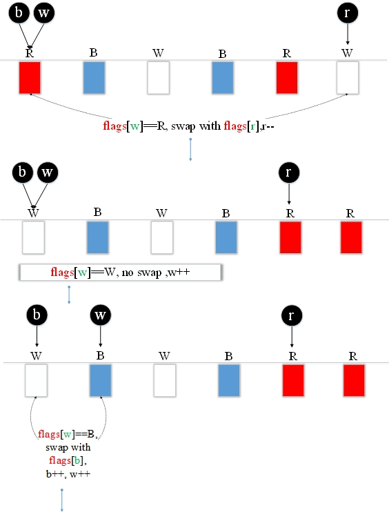
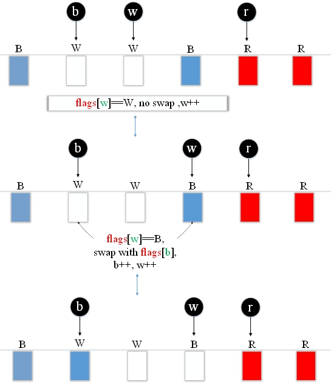

# 29.迪克斯特拉

三色旗最初是由EW Dijkstra举起的，他使用了荷兰国旗（Dijkstra是荷兰人）。

假设有一条带有红色，白色和蓝色标志的绳索。最初，绳索上的所有标记均未按顺序排列。您需要按照蓝色->白色->红色的顺序排列它们。 如何以最少的时间移动它们。您只需在绳索上执行此操作，并且一次仅交换两个标志。



**解决方案：**

使用<font color="red">char arrays</font> 存储<font color="red">标志</font> 。例如，<font color="green">b</font> ，<font color="green">w</font> 和<font color="green">r </font>指示**蓝色** ，**白色** 和**红色** 标志的位置。<font color="green">b</font> 和<font color="green">w</font>的开头 是数组的0，而<font color="green">r</font> 在数组的末尾。

（1）如果<font color="green">w</font>的位置 是一个蓝色标记，则<font color="red">标记 </font>[<font color="green"> w </font>]与标记 [ b ] 交换。并且<font color="green">whiteIndex</font> 和<font color="green">b</font> 向后移1。

（2）如果<font color="green">w</font>的位置 是白旗，则<font color="green">w </font>向后移动1。

（3）如果<font color="green">w</font>的位置 是一个红色标记，则<font color="red">标记</font> [ <font color="green">w </font>]与<font color="red">标记 </font>[ <font color="green">r </font>] 交换。<font color="green">r</font> 向前移动1。

最后，<font color="green">b</font>前面的标志 都是蓝色，<font color="green">r</font>后面的标志 都是红色。

**图解**





**Dijkstra.go**

```go
package main

import "fmt"

func main() {
	var flags = []string {"R" , "B" , "W" , "B" , "R" , "W" }
	var length = len (flags)
	var b = 0
	var w = 0
	var r = length - 1
	var count = 0
	for {
		if w > r {
			break
		}
		if flags[w] == "W" {
			w++
		} else if flags[w] == "B" {
			var temp = flags[w]
			flags[w] = flags[b]
			flags[b] = temp
			w++
			b++
			count++
		} else if flags[w] == "R" {
			var m = flags[w]
			flags[w] = flags[r]
			flags[r] = m
			r--
			count++
		}
	}
	for i := 0 ; i < length; i++ {
		fmt.Printf("%s" , flags[i])
	}
	fmt.Printf("\n总交换计数  : %d" , count)
}
```

**结果：**

```
BBWWRR
总交换计数  : 4
```

