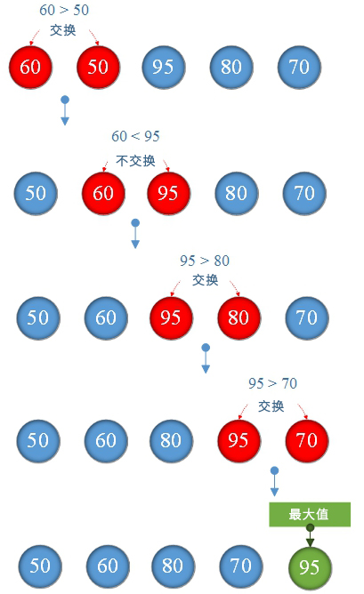
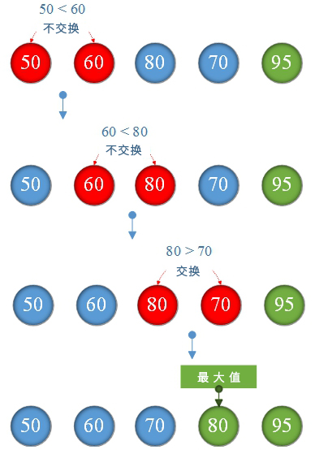
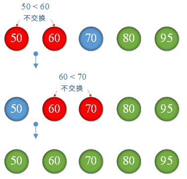

# 3.冒泡排序算法

**冒泡算法：**

比较 <font color="red">arrays[j] </font>与 <font color="red">arrays[j + 1] </font>, 如果<font color="red">arrays[j] </font>><font color="red">arrays[j + 1] </font> 则交换。其余元素重复此过程，直到完成排序。

**将一下数字从小到大排序**


**说明：**

没有排序

比较

已经排序

**1.第一次排序：**




**2 .第二次排序：**



**3.第三次排序：**



**没有交换，所以终止排序** ：我们就可以获得数字从小到大的排序


**TestBubbleSort.go**

```go
package main

import "fmt"

func main(){
	//索引从0开始
	var scores=[]int{90,70,50,80,60,85}
	var length=len(scores)
	sort(scores,length)
	for i := 0; i < length; i++ {
		fmt.Printf("%d,",scores[i])
	}
}

func sort(arrays []int,length int){
	for i := 0; i < length-1; i++ {
		for j := 0; j < length-i-1; j++ {
			if arrays[j]>arrays[j+1] {//交换
				var flag=arrays[j]
				arrays[j]=arrays[j+1]
				arrays[j+1]=flag
			}
		}
	}
}
```

**结果：**

```
50,60,70,80,85,90,
```

