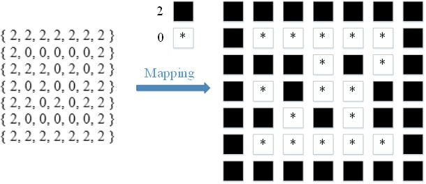
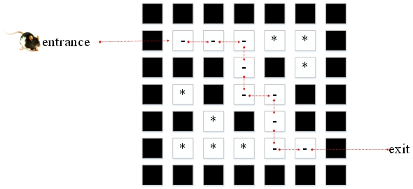

# 30.老鼠走迷宫

老鼠走迷宫是一种基本类型的递归解决方案。我们用2 来表示壁 的二维数组 ，并用1 来表示老鼠行走道路，并试图找到从入口到出口的路径。

**解决方案：**

老鼠在四个方向上移动：上，左，下和右 。如果撞到墙， 请返回并选择下一个前进方向，因此测试数组中的四个方向，直到老鼠到达出口为止。

**图解**





**MouseWalkingMaze.go**

```go
package main

import "fmt"

var maze = [7][7]int{
	{2, 2, 2, 2, 2, 2, 2},
	{2, 0, 0, 0, 0, 0, 2},
	{2, 2, 2, 0, 2, 0, 2},
	{2, 0, 2, 0, 0, 2, 2},
	{2, 2, 0, 2, 0, 2, 2},
	{2, 0, 0, 0, 0, 0, 2},
	{2, 2, 2, 2, 2, 2, 2},
}

var startI = 1
var startJ = 1
var endI = 5
var endJ = 5
var success = 0

//老鼠在四个方向移动:上，左，下，右。如果撞到墙，返回并选择下一个前进方向
func visit(i int, j int) int {
	maze[i][j] = 1
	if i == endI && j == endJ {
		success = 1
	}
	if success != 1 && maze[i][j+1] == 0 {
		visit(i, j+1)
	}
	if success != 1 && maze[i+1][j] == 0 {
		visit(i+1, j)
	}
	if success != 1 && maze[i][j-1] == 0 {
		visit(i, j-1)
	}
	if success != 1 && maze[i-1][j] == 0 {
		visit(i-1, j)
	}
	if success != 1 {
		maze[i][j] = 0
	}
	return success
}

func main() {
	fmt.Printf("迷宫 ： \n")
	for i := 0; i < 7; i++ {
		for j := 0; j < 7; j++ {
			if maze[i][j] == 2 {
				fmt.Printf("█ ")
			} else {
				fmt.Printf("* ")
			}
		}
		fmt.Printf("\n")
	}
	if visit(startI, startJ) == 0 {
		fmt.Printf("没有找到出口 \n")
	} else {
		fmt.Printf("迷宫路径 : \n")
		for i := 0; i < 7; i++ {
			for j := 0; j < 7; j++ {
				if maze[i][j] == 2 {
					fmt.Printf("█ ")
				} else if maze[i][j] == 1 {
					fmt.Printf("- ")
				} else {
					fmt.Printf("* ")
				}
			}
			fmt.Printf("\n")
		}
	}
}
```

```
迷宫 ：
█ █ █ █ █ █ █
█ * * * * * █
█ █ █ * █ * █
█ * █ * * █ █
█ █ * █ * █ █
█ * * * * * █
█ █ █ █ █ █ █
迷宫路径 :
█ █ █ █ █ █ █
█ - - - * * █
█ █ █ - █ * █
█ * █ - - █ █
█ █ * █ - █ █
█ * * * - - █
█ █ █ █ █ █ █
```

