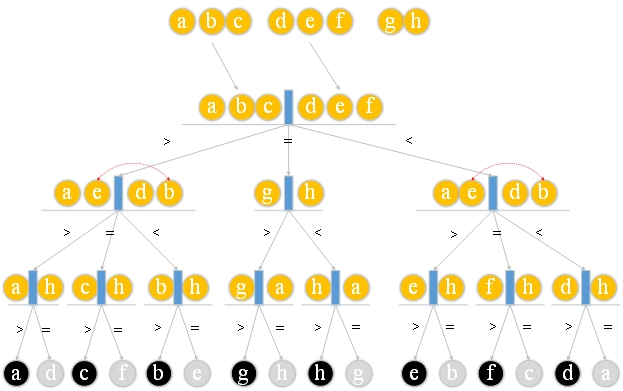

# 30.八枚硬币

有八枚外观相同的硬币，一枚是伪造的硬币，伪造的硬币的重量与真实的硬币不同，但未知的是伪造的硬币比真实的硬币轻还是重。请设计一种有效的算法来检测此假币。

**解决方案：**

从八枚硬币中取六个<font color="red">a，b，c，d，e，f，</font>然后将三个放在天平上进行比较。假设<font color="red">a，b，c </font>位于一侧，而<font color="red">d，e，f </font>位于另一侧。

1.a + b + c> d + e + f

2.a + b + c = d + e + f

3.a + b + c <d + e + f

如果<font color="red">a + b + c> d + e + f </font>，则这六枚硬币之一中有一个伪造的硬币，而<font color="red">g，h </font>是真实的硬币。此时，可以从两面取出一个硬币。假设 删除了<font color="red">c和f</font>。同时，每侧更换一枚硬币。假设硬币<font color="red">b和e </font>互换，然后进行第二次比较。还有三种可能性：

1. <font color="red">a + e> d + b：</font>  假币必须是<font color="red">a，d之一 </font>。只要将真实货币<font color="red">h与a</font>进行比较 ，我们就可以找到伪造的货币。如果<font color="red">a> h </font>，则<font color="red">a</font> 是较重的伪造货币；如果<font color="red">a = h </font>，则<font color="red">d </font>是较轻的伪造货币。

2. <font color="red">a + e = d + b：</font> 假币必须是<font color="red">c，f之一</font>， 并且真实硬币<font color="red">h 与c</font>进行比较 。如果<font color="red">c> h</font> ，则<font color="red">c </font>是较重的伪造货币；如果<font color="red">c = h </font>，则<font color="red">f </font>是较轻的伪造货币。

3. <font color="red">a+ e <d + b：</font> 一个<font color="red">b或e </font>是伪造的硬币，还可以使用实硬币<font color="red">h </font> 与比较吧<font color="red">b，</font>如果<font color="red">b>h，</font> 然后<font color="red">b </font>是较重的假币; 如果<font color="red">b = h，</font> 则<font color="red">e </font>是较轻的伪造货币；

**图解**

重轻



**EightCoins.go**

```go
package main

import (
	"fmt"
	"math/rand"
)

func compare(coins []int , i int , j int , k int ) { //coin[k] true,coin[i]>coin[j]
	if coins[i] > coins[k] { //coin[i]>coin[j]&&coin[i]>coin[k] ----->coin[i] 是一枚重的假币
		fmt.Printf("\n假币 %d 较重\n" , (i + 1 ))
	} else { //coin[j] is a light counterfeit coin
		fmt.Printf("\n假币 %d 较轻\n " , (j + 1 ))
	}
}

func eightcoins(coins []int ) {
	if coins[0 ]+coins[1 ]+coins[2 ] == coins[3 ]+coins[4 ]+coins[5 ] { //(a+b+c)==(d+e+f)
		if coins[6 ] > coins[7 ] { //g>h?(g>a?g:a):(h>a?h:a)
			compare(coins, 6 , 7 , 0 )
		} else { //h>g?(h>a?h:a):(g>a?g:a)
			compare(coins, 7 , 6 , 0 )
		}
	} else if coins[0 ]+coins[1 ]+coins[2 ] > coins[3 ]+coins[4 ]+coins[5 ] { //(a+b+c)>(d+e+f)
		if coins[0 ]+coins[3 ] == coins[1 ]+coins[4 ] { //(a+e)==(d+b)
			compare(coins, 2 , 5 , 0 )
		} else if coins[0 ]+coins[3 ] > coins[1 ]+coins[4 ] { //(a+e)>(d+b)
			compare(coins, 0 , 4 , 1 )
		}
		if coins[0 ]+coins[3 ] < coins[1 ]+coins[4 ] { //(a+e)<(d+b)
			compare(coins, 1 , 3 , 0 )
		}
	} else if coins[0 ]+coins[1 ]+coins[2 ] < coins[3 ]+coins[4 ]+coins[5 ] { //(a+b+c)<(d+e+f)
		if coins[0 ]+coins[3 ] == coins[1 ]+coins[4 ] { //(a+e)>(d+b)
			compare(coins, 5 , 2 , 0 )
		} else if coins[0 ]+coins[3 ] > coins[1 ]+coins[4 ] { //(a+e)>(d+b)
			compare(coins, 3 , 1 , 0 )
		}
		if coins[0 ]+coins[3 ] < coins[1 ]+coins[4 ] { //(a+e)<(d+b)
			compare(coins, 4 , 0 , 1 )
		}
	}
}

func main() {
	var coins = make ([]int , 8 )
	// Initial coin weight is 10
	for i := 0 ; i < 8 ; i++ {
		coins[i] = 10
	}
	fmt.Printf("输入假币权重(大于或小于10):" )
	var coin int
	fmt.Scanf("%d" , &coin)
	var index = rand.Intn(8 )
	coins[index] = coin
	eightcoins(coins)
	for i := 0 ; i < 8 ; i++ {
		fmt.Printf("%d , " , coins[i])
	}
}
```

**结果：**

```
第一次运行:
输入假币权重(大于或小于10):
2
假币 2 较轻
10 , 2 , 10 , 10 , 10 , 10 , 10 , 10 ,

第二次运行:
输入假币权重(大于或小于10):
13
假币 4 较轻
10 , 10 , 10 , 13 , 10 , 10 , 10 , 10 ,
```

