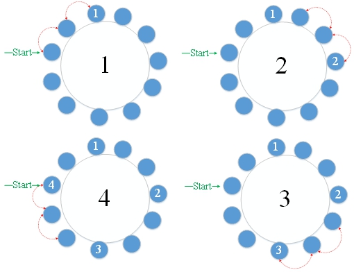
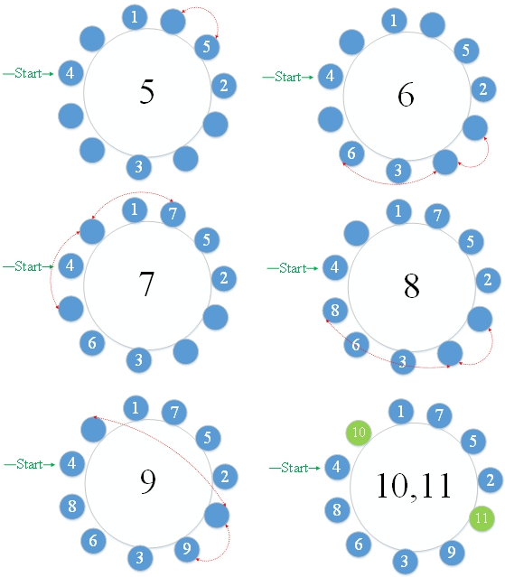

# 33.约瑟夫斯问题

有<font color="red">9名犹太人</font> 与<font color="red">约瑟夫斯</font> 和<font color="red">他的朋友</font>一起藏在一个洞里 。9名犹太人决定死而不是被敌人抓住，因此他们决定采用自杀方式，将11个人围成一个圈，第一个人举报该人数。将每个数字报告给第三人后，该人必须自杀。然后从下一个开始再次计数，直到每个人自杀为止。但是约瑟夫斯和他的朋友们不想服从。约瑟夫斯（Josephus）要求他的朋友假装服从，他自己安排了朋友。在第二和第七位置，他们逃脱了这场死亡比赛。

**解决方案：**

只要将数组视为环形即可。填写每个无数据区域的计数，直到计数达到11，然后从索引1列出数组，您可以知道该位置的每个自杀顺序都是约瑟夫的位置。11人的职位如下：

4 <font color="green">10 </font>1 7 5 2 <font color="green">11</font> 9 3 6 8

从上面可以看出，最后两次自杀是在第31位和第16位。上一个

每个人都死了，所以他们不知道约瑟夫和他的朋友们没有遵守游戏规则。





**Joseph.go**

```go
package main

import "fmt"

const N = 11
const M = 3

func main() {
	var man = [N]int {0 }
	var count = 1
	var i = 0
	var pos = -1
	for {
		if count > N {
			break
		}
		for {
			pos = (pos + 1 ) % N // Ring
			if man[pos] == 0 {
				i++
			}
			if i == M {
				i = 0
				break
			}
		}
		man[pos] = count
		count++
	}
	fmt.Printf("\n约瑟夫序列： " )
	for i := 0 ; i < N; i++ {
		fmt.Printf("%d , " , man[i])
	}
}

```

**结果：**

```
约瑟夫序列： 4 , 10 , 1 , 7 , 5 , 2 , 11 , 9 , 3 , 6 , 8 ,
```

