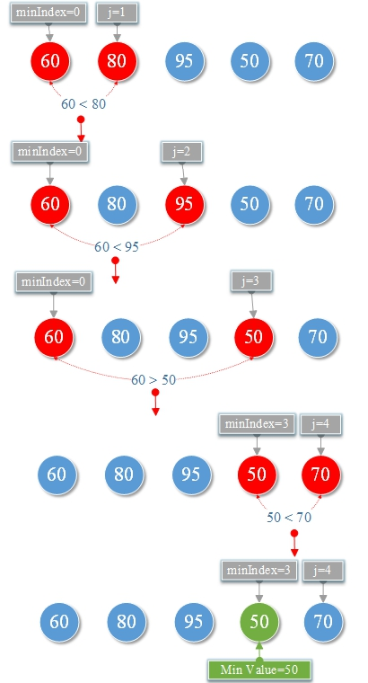

# 4.最小值

**搜索整数序列的最小值：**


**1.算法思想**

初始值<font color="red">minIndex = 0</font>，<font color="red">j = 1 </font>将<font color="red">array [minIndex] </font>与<font color="red">array [j]</font>比较，

如果<font color="red">arrays [minIndex]</font>> <font color="red">arrays [j]</font>， 则<font color="red">minIndex = j</font>，<font color="red">j ++</font>， 否则<font color="red">j ++</font>。 继续直到最后一个数字，<font color="red">arrays [minIndex] </font>是最小值。



**TestMinValue.go**

```go
package main

import "fmt"

func min(arrays []int, length int) int {
	var minIndex=0 //最小索引
	for j := 0; j < length; j++ {
		if arrays[minIndex]>arrays[j]{
			minIndex=j
		}
	}
	return arrays[minIndex]
}
func main() {
	var scores=[]int{60,80,95,50,70}
	var length=len(scores)
	var minValue=min(scores,length)
	fmt.Printf("Min Value= %d\n",minValue)
}
```

**结果:**

```
Min Value= 50
```

