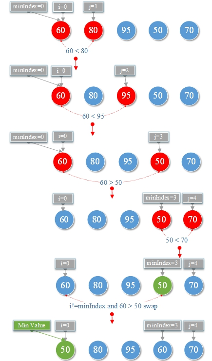
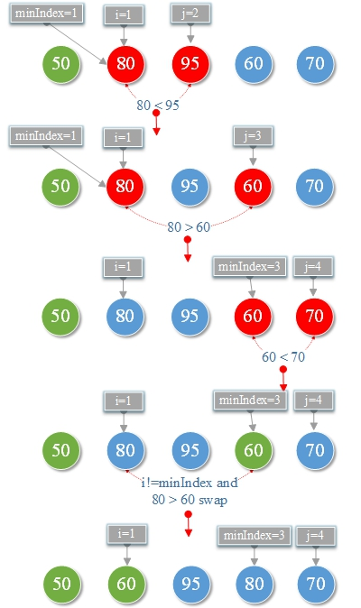
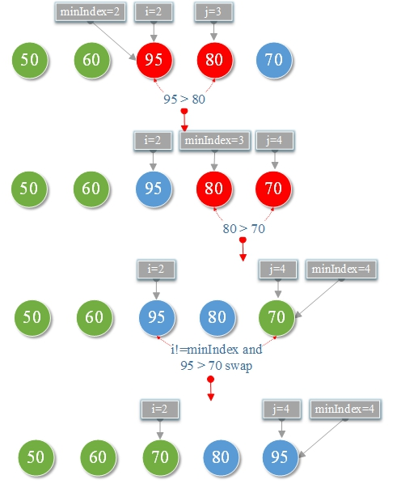
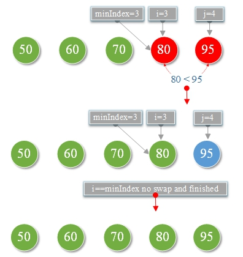

# 5.选择排序算法

**选择排序算法：**

通过反复从未排序部分中找到最小元素并将其放在开头来对数组进行排序。

**将以下数字从大到小排序**


**说明：**

没有排序

比较

已经排序

**1.第一次排序：**



**2.第二次排序：**



**3.第三次排序：**



**4.第四次排序：**



**我们可以得到从小到大的排序数字**


**TestSelectSort.go**

```go
package main

import "fmt"

func main() {
	var scores=[]int{90,70,50,80,60,85}
	var length=len(scores)
	sort(scores,length)
	for i := 0; i < length; i++ {
		fmt.Printf("%d,",scores[i])
	}
}

func sort(arrays []int,length int)  {
	var minIndex int //储存最小值的索引
	for i := 0; i < length-1; i++ {
		minIndex=i
		//记录最小的索引和最小数
		var minValue=arrays[minIndex]
		for j := i; j <length-1 ; j++ {
			if minValue>arrays[j+1] {
				minValue=arrays[j+1]
				minIndex=j+1
			}
		}

		//如果i不是最小数时，则交换两个值
		if i!=minIndex{
			var temp=arrays[i]
			arrays[i]=arrays[minIndex]
			arrays[minIndex]=temp
		}
	}
}
```

**结果:**

```
50,60,70,80,85,90,
```

