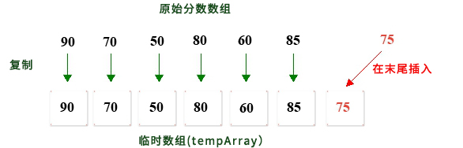

# 6.线性表追加

**1.在一维数组分数的末尾添加分数75。**



**分析：**

1. 首先创建一个临时数组（<font color="red">tempArray</font>），该数组大于原始的scores数组长度

2. 将分数的每个值复制到<font color="red">tempArray</font>

3. 将75分配给<font color="red">tempArray</font>的最后一个索引位置

4. 最后，将<font color="red">tempArray </font>指针引用分配给原始分数；

**TestOneArrayAppend.go**

```go
package main

import "fmt"

func main() {
	var scores = []int {90 , 70 , 50 , 80 , 60 , 85 }
	var length = len (scores)
	var tempArray = make ([]int , length+1 ) //创建临时数组
	for i := 0 ; i < length; i++ {
		tempArray[i] = scores[i]
	}
	tempArray[length] = 75
	scores = tempArray
	for i := 0 ; i < length+1 ; i++ {
		fmt.Printf("%d," , scores[i])
	}
}
```

**结果:**

```
90,70,50,80,60,85,75,
```

