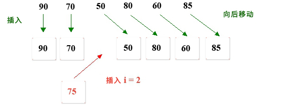

# 7.线性表插入

**1.在一维数组中的任意位置插入学生分数。**



**分析：**

1. 首先创建一个临时数组<font color="red">tempArray</font>，其长度大于原始的scores数组的长度。

2. 将scores数组的先前值的每个值从开头复制到插入位置，再复制到<font color="red">tempArray</font>。

3. 将scores数组从插入位置移至最后一个元素的每个值，然后将其移回<font color="red">tempArray</font>

4. 然后将分数75插入<font color="red">tempArray</font>的索引。

5. 最后将<font color="red">tempArray</font>指针引用分配给分数；

**TestOneArrayInsert.go**

```go
package main

import "fmt"

func main(){
	var scores = []int {90 , 70 , 50 , 80 , 60 , 85 }
	var length = len (scores)
	var tempArray = make ([]int , length+1 )
	insert(scores, length, tempArray, 75 , 2 ) //在索引为2的位置插入75
	scores = tempArray
	for i := 0 ; i < length+1 ; i++ {
		fmt.Printf("%d," , scores[i])
	}
}

func insert(array []int , length int , tempArray []int , score int , insertIndex int )  {
	for i := 0; i < length; i++ {
		if i<insertIndex {
			tempArray[i]=array[i]
		}else {
			tempArray[i+1]=array[i]
		}
	}
	tempArray[insertIndex]=score
}
```

**结果:**

```
90,70,75,50,80,60,85,
```

