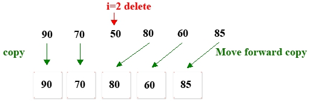

# 8.线性表删除

**1.从分数数组中删除` index=2`的值**



**分析：**

1. 创建一个临时数组<font color="red">tempArray </font>，其长度比分数小1。

2. 将<font color="red">i = 2</font>前面的数据复制 到<font color="red">tempArray</font>的前面

3. 将<font color="red">i = 2</font>之后的数组复制 到<font color="red">tempArray</font>的末尾

4. 将<font color="red">tempArray </font>指针引用分配给分数

5. 打印成绩

**TestOneArrayDelete.go**

```go
package main

import (
	"fmt"
)

func main() {
	var scores = []int {90 , 70 , 50 , 80 , 60 , 85 }
	fmt.Printf("请输入要删除的索引:\n")
	var index int
	fmt.Scan(&index)

	var length=len(scores)
	var tempArray=make([]int,length-1)//创建临时数组
	for i := 0; i < length; i++ {
		if i<index {//将索引前面的数据复制到tempArray的前面
			tempArray[i]=scores[i]
		}else {//将索引后的数组复制到tempArray的后面
			tempArray[i-1]=scores[i]
		}
	}

	scores=tempArray
	for i := 0; i < length-1; i++ {
		fmt.Printf("%d,",scores[i])
	}
}
```

**结果:**

```
请输入要删除的索引:
2
90,50,80,60,85,
```

