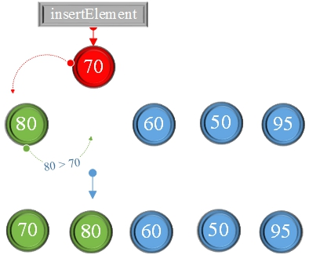
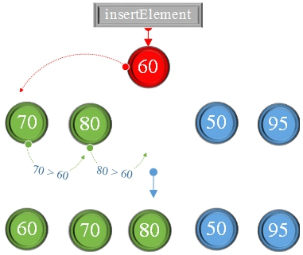
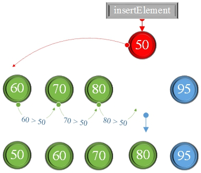
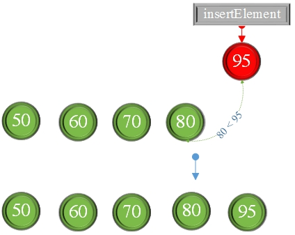

# 9.插入排序算法

**插入排序算法：**

在数组中获取一个未排序的新元素，将其与已排序的元素进行比较，如果该元素小于已排序的元素，则将新元素插入到正确的位置。


**说明：**

没有排序

插入

已经排序

**1.第一次排序:**



**2.第二次排序:**



**3.第三次排序:**



**4.第四次排序:**



**TestInsertSort.go**

```go
package main

import (
	"fmt"
)

func main()  {
	//索引从0开始
	var scores = []int {90 , 70 , 50 , 80 , 60 , 85 }
	var length = len (scores)
	sort(scores, length)
	for i := 0 ; i < length; i++ {
		fmt.Printf("%d," , scores[i])
	}
}

func sort(arrays []int, length int)  {
	for i := 0; i < length; i++ {
		var insertElement=arrays[i] //获取未排序的新元素
		var insertPosition=i //插入位置
		for j := insertPosition-1; j >=0 ; j-- {
			//如果新元素小于已排序元素，则已排序元素向右移动
			if insertElement<arrays[j]{
				arrays[j+1]=arrays[j]
				insertPosition--
			}
		}
		arrays[insertPosition]=insertElement //插入新元素
	}
}
```

**结果：**

```
50,60,70,80,85,90,
```

